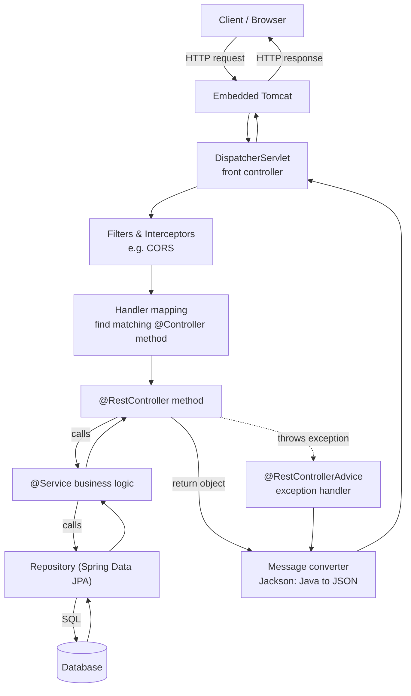
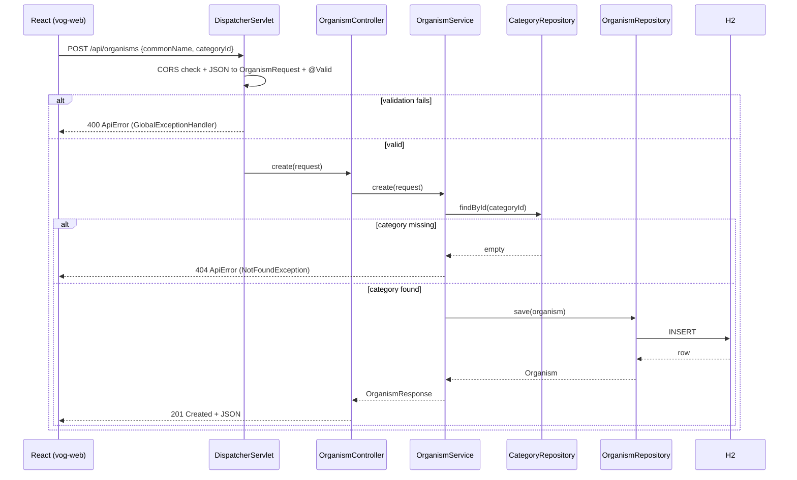

# Vog — Living Things Catalog

A small full-stack app to catalog living things (mammals, fish, birds, plants,
humans…) and assign each to a category. Spring Boot REST backend + React frontend.

- **Backend:** `vog-demo/` — Spring Boot 4.1.0, Java 17, Spring Data JPA, H2.
- **Frontend:** `vog-web/` (sibling folder) — React + Vite + TypeScript.

**Docs:**
- [`docs/SPRING-BOOT-DEV-GUIDE.md`](docs/SPRING-BOOT-DEV-GUIDE.md) — beginner Spring Boot guide: creating a project in VS Code, where Initializr settings live, adding libraries, changing the baseline.
- [`docs/TUTORIAL.md`](docs/TUTORIAL.md) — step-by-step run-through of this app.
- [`docs/ENVIRONMENT.md`](docs/ENVIRONMENT.md) — environment setup & Java version management.
- [`docs/superpowers/`](docs/superpowers/) — design spec and implementation plan.

---

## What it does

- Manage **categories** (Mammal, Fish, Bird, Plant, Human, Reptile, Amphibian, Insect…): list, create, delete.
- Manage **organisms**: list, filter by category or name, create, delete. Each organism belongs to one category.
- Seeds example data on first startup so there is something to see immediately.
- Deleting a category that still has organisms is blocked with a clear error (409).

---

## How to run

### 1. Backend (port 8080)

```bash
cd vog-demo
sdk env                    # activate Java 17 (see docs/ENVIRONMENT.md)
./mvnw spring-boot:run
```

Once started:
- API base: `http://localhost:8080/api`
- **Swagger UI: `http://localhost:8080/swagger-ui.html`**
- OpenAPI JSON: `http://localhost:8080/v3/api-docs`
- H2 DB console: `http://localhost:8080/h2-console` (JDBC URL `jdbc:h2:mem:vogdb`, user `sa`, empty password)

### 2. Frontend (port 5173)

In a second terminal, with the backend running:

```bash
cd vog-web
npm install                # first time only
npm run dev
```

Open `http://localhost:5173`. The API base URL is configured in `vog-web/.env`
(`VITE_API_BASE`).

---

## How to test

### Backend
```bash
cd vog-demo
./mvnw test
```
This runs:
- **Repository tests** (`@DataJpaTest`) — custom query methods against H2.
- **Service tests** (Mockito) — business rules (in-use category can't be deleted, unknown ids raise not-found).
- **Controller tests** (`@WebMvcTest` + MockMvc) — HTTP status codes and JSON, including validation → 400 and unknown id → 404.

### Frontend
```bash
cd vog-web
npm run build              # type-checks (tsc) + production build
```

---

## Browsing the API with Swagger UI

The backend publishes interactive API documentation via **springdoc-openapi**. You
do not need Postman or curl to explore it.

1. Start the backend (`./mvnw spring-boot:run`).
2. Open **`http://localhost:8080/swagger-ui.html`** in a browser.
3. You'll see two groups of endpoints, **category-controller** and
   **organism-controller**, each listing every operation (GET/POST/PUT/DELETE).
4. Click any endpoint to expand it. It shows the parameters, the request body
   schema, and example responses.
5. Click **"Try it out"**, fill in the parameters or JSON body, then **"Execute"**.
   Swagger sends the real HTTP request and shows you the response code, body, and
   the exact `curl` command it used.

Example — create an organism from Swagger:
1. Expand `POST /api/organisms` → **Try it out**.
2. Edit the JSON body:
   ```json
   { "commonName": "Blue Whale", "scientificName": "Balaenoptera musculus", "habitat": "Ocean", "categoryId": 1 }
   ```
3. **Execute** → you should get `201 Created` with the saved organism.

Prefer the command line? The same call with curl:
```bash
curl -X POST http://localhost:8080/api/organisms \
  -H 'Content-Type: application/json' \
  -d '{"commonName":"Blue Whale","scientificName":"Balaenoptera musculus","habitat":"Ocean","categoryId":1}'
```

The raw machine-readable spec (for importing into Postman/Insomnia or generating
clients) is at `http://localhost:8080/v3/api-docs`.

---

## Reading the API docs offline (app not running)

Swagger UI itself is generated and served *by the running app*, so it only works
while the backend is up. In the real world, though, you rarely need the app to
read the docs — you export the **OpenAPI spec file** once and read *that* offline.
The spec is the source of truth; everything below consumes it.

### 1. Export the spec to a file (do this once, while the app runs)
```bash
curl http://localhost:8080/v3/api-docs -o openapi.json      # JSON
curl http://localhost:8080/v3/api-docs.yaml -o openapi.yaml  # or YAML
```
Commit `openapi.json` to the repo so others get it without running anything.

### 2. Generate it automatically in the build / CI (recommended)
Add the `springdoc-openapi-maven-plugin` to `pom.xml`. During the build it briefly
starts the app, downloads `/v3/api-docs` to `target/openapi.json`, and stops the
app — so the spec is always regenerated in sync with the code and can be published
by CI. (Not wired up in this demo; this is the standard production approach.)

### 3. Render the spec as standalone offline HTML (no app, no internet)
```bash
npx @redocly/cli build-docs openapi.json -o api-docs.html
```
Open `api-docs.html` in any browser. It's fully self-contained — the app never
runs. This is a common way to publish/share API docs.

### 4. Import the spec into an API client
Load `openapi.json` into **Postman, Insomnia, or Bruno** to get a ready-made
collection of all endpoints you can browse and call offline.

### 5. Publish to an API catalog / portal
In larger orgs the exported spec is pushed to **SwaggerHub, Backstage, or an
internal API portal** so consumers discover and read it centrally, independent of
the app.

**Summary:** the running app is only needed to *produce* the OpenAPI file
(`/v3/api-docs`); consumers read that file — via Redoc HTML, Postman, or a portal —
entirely offline.

---

## How a request flows through the app

### Generic Spring Boot request flow

Every HTTP request into a Spring Boot web app passes through the same pipeline.
The embedded **Tomcat** server hands the request to Spring's **DispatcherServlet**,
which is the "front controller" that routes it to the right method:


<details><summary>Mermaid source (renders on GitHub / with a Mermaid extension)</summary>



</details>

ASCII view of the same idea:

```
Browser ──HTTP──> Tomcat ──> DispatcherServlet ──> Filters(CORS) ──> Controller
                                                                        │
                                                                        ▼
                                                                     Service
                                                                        │
                                                                        ▼
                                                                   Repository
                                                                        │
                                                                        ▼
                                                                     Database
   response (JSON) <── Jackson <── Controller <── (or Exception ──> @RestControllerAdvice)
```

### This app's flow — example: `POST /api/organisms`


<details><summary>Mermaid source (renders on GitHub / with a Mermaid extension)</summary>



</details>

**In words:** the React app sends JSON → Spring's DispatcherServlet applies CORS,
parses the body into an `OrganismRequest` and validates it → `OrganismController`
delegates to `OrganismService` → the service checks the category exists via
`CategoryRepository`, then persists through `OrganismRepository` → the entity is
mapped to an `OrganismResponse` DTO and serialized back to JSON. Any error
(validation, not-found, in-use) is turned into a consistent `ApiError` body by the
`GlobalExceptionHandler`.

### The main components (map to the folders under `src/main/java`)

| Layer | Package | Responsibility |
|-------|---------|----------------|
| Entry point | `VogDemoApplication` | Boots the app + embedded server. |
| Controllers | `controller/` | Map HTTP verbs/URLs to methods; know HTTP, not business rules. |
| Services | `service/` | Business logic and validation; the heart of the app. |
| Repositories | `repository/` | Data access; Spring Data generates the SQL. |
| Entities | `entity/` | Java classes mapped to DB tables (`Category`, `Organism`). |
| DTOs | `dto/` | Request/response shapes + bean validation, decoupled from entities. |
| Exceptions | `exception/` | Custom exceptions + one `@RestControllerAdvice` for consistent errors. |
| Config | `config/` | `DataSeeder` (startup data) and `CorsConfig` (allow the React dev server). |
