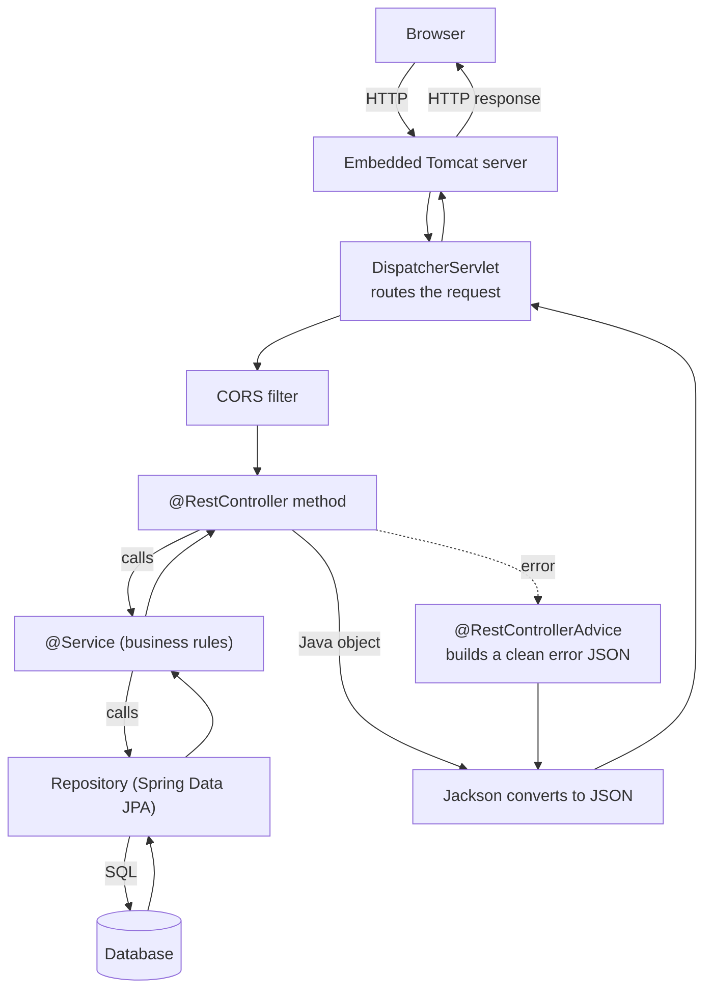
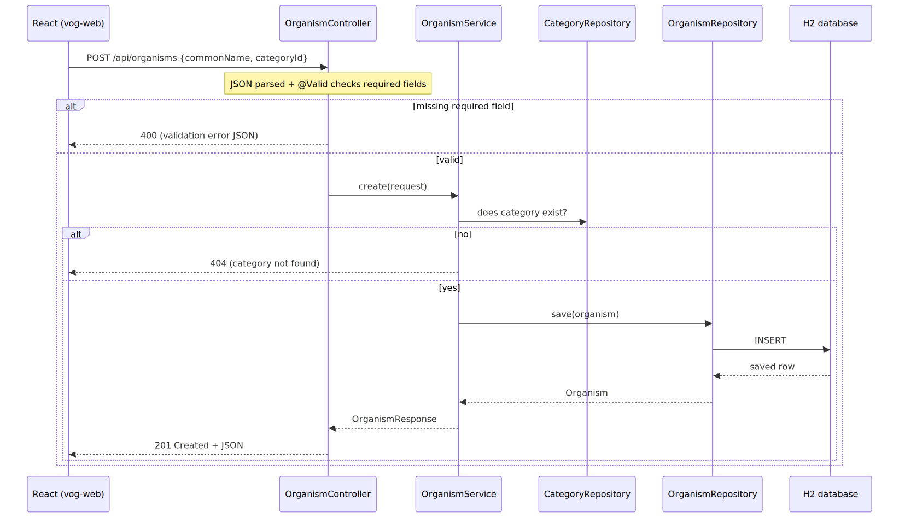
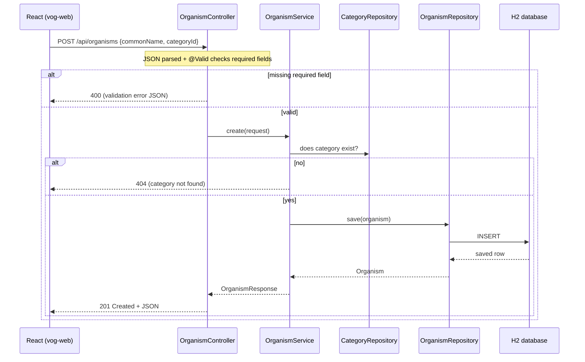

# Vog — Step-by-Step Tutorial (for a brand-new user)

This is a complete, follow-along guide. It assumes you have **never used Spring
Boot** and may be new to Java tooling. By the end you will understand every tool
involved, have the app running, and know how requests flow through it.

Work through the sections **in order**. Each command shows what you should expect
to see, so you can confirm you're on track.

> Convention: lines starting with `$` are commands you type (without the `$`).
> Everything else is expected output or explanation.

---

## Part 0 — What you're building

A small full-stack web app called **Vog** that catalogs living things and sorts
them into categories (Mammal, Fish, Bird, Plant, Human…). It has two halves:

- A **backend** (`vog-demo/`) — a Java program that stores the data and exposes a
  REST API (URLs that return JSON).
- A **frontend** (`vog-web/`) — a React web page that talks to that API in your
  browser.

```
You (browser)  ⇄  React frontend (port 5173)  ⇄  Spring Boot backend (port 8080)  ⇄  Database
```

---

## Part 1 — The tools, explained

You don't need to be an expert in these, but here's what each one is and why it's
here.

| Tool | What it is | Why we need it |
|------|-----------|----------------|
| **Java (JDK)** | The programming language + runtime the backend is written in. "JDK" = Java Development Kit. | Spring Boot is Java. We need **JDK 17**. |
| **SDKMAN** | A version manager for Java (and Maven). Lets you install and switch between multiple Java versions. | This machine has several Java versions; SDKMAN picks the right one. |
| **Maven** | A build tool for Java. It downloads libraries, compiles code, runs tests, and packages the app. | Spring Boot projects are built with Maven. |
| **Maven Wrapper (`./mvnw`)** | A small script committed in the project that downloads the *correct* Maven version automatically. | So everyone uses the same Maven (3.9.16) without installing it. |
| **Spring Boot** | A framework that makes building Java web apps fast — it auto-configures a web server, database access, JSON handling, etc. | It's the backbone of the backend. |
| **Spring Data JPA** | A Spring library that turns Java objects into database rows and back, so you barely write SQL. | Saves/loads categories and organisms. |
| **H2** | A tiny database that runs *inside* the app, in memory. | Zero setup — great for a demo. Data resets on restart. |
| **springdoc / Swagger UI** | Generates interactive API documentation you can click through in a browser. | Lets you try the API without any extra tool. |
| **Node.js + npm** | JavaScript runtime + package manager. | Needed to build and run the React frontend. |
| **Vite** | A fast build/dev-server tool for frontend apps. | Runs the React app with instant reload. |
| **React + TypeScript** | React builds the UI from components; TypeScript adds type safety to JavaScript. | The frontend is written in them. |

---

## Part 2 — Validate your environment

Before building anything, confirm the tools are present and the right versions.
Run each command and compare to the expected output.

### 2.1 Java — must be 17

```
$ java -version
```
Expected (the important part is **17**):
```
openjdk version "17.0.19" ...
```
If you instead see `1.8.x` (Java 8) or `11.x`, your Java is too old — fix it in
Part 3.

### 2.2 SDKMAN — the Java manager

```
$ sdk current java
```
Expected: something like `Using java version 17.0.19-tem`.

If you get `sdk: command not found`, load it first (then re-run):
```
$ source "$HOME/.sdkman/bin/sdkman-init.sh"
```

### 2.3 Maven Wrapper — must report Java 17

```
$ cd vog-demo
$ ./mvnw -version
```
Expected:
```
Apache Maven 3.9.16 ...
Java version: 17.0.19, vendor: Eclipse Adoptium ...
```

### 2.4 Node and npm — for the frontend

```
$ node -v      # expect v18 or higher (e.g. v24.9.0)
$ npm -v       # expect 9 or higher (e.g. 11.6.0)
```

### 2.5 git

```
$ git --version
```

If **all five** pass, skip to Part 4. If Java was wrong, do Part 3 first.

---

## Part 3 — Install / manage Java versions (only if Java isn't 17)

This machine uses **SDKMAN** to manage Java. Here's the full workflow.

### 3.1 See what's installed
```
$ sdk list java | grep installed
```
You'll see entries like `8.0.482-tem`, `11.0.21-tem`, `17.0.19-tem`. The `-tem`
means the Temurin distribution.

### 3.2 Install Java 17 (if missing)
```
$ sdk install java 17.0.19-tem
```
This downloads and installs it. When it asks *"set as default?"*, you can answer
**n** (no) — we'll pin it per-project instead so your other projects keep their
Java.

### 3.3 Switch Java — three ways

| Command | Effect | When to use |
|---------|--------|-------------|
| `sdk use java 17.0.19-tem` | Switches **only the current terminal**. Reverts when closed. | Quick, temporary. |
| `sdk default java 17.0.19-tem` | Switches **globally** for all new terminals. | Only if you want 17 everywhere. |
| `sdk env` | Reads `.sdkmanrc` and switches to the version **this project** needs. | Recommended for this repo. |

> **Gotcha:** right after `sdk use`, the *same* terminal may still print the old
> version because bash caches command paths. Run `hash -r` once, or just open a
> new terminal, and it'll be correct.

### 3.4 This project auto-pins Java 17

There's a file `vog-demo/.sdkmanrc` containing `java=17.0.19-tem`. So from inside
`vog-demo/` you can simply run:
```
$ sdk env
```
and this terminal switches to Java 17. To make it automatic every time you `cd`
in, enable it once:
```
$ sdk config          # then set  sdkman_auto_env=true
```

More detail lives in [`ENVIRONMENT.md`](ENVIRONMENT.md).

---

## Part 4 — Tour the project

### How this project was created (and how to make your own)

`vog-demo` was generated by **Spring Initializr** — a project generator you can run
right inside VS Code with the Spring Boot Extension Pack (`Ctrl+Shift+P` →
`Spring Initializr: Create a Maven Project`). Everything you'd pick there — the
Spring Boot version, Group/Artifact Id, Java version, and the libraries — is
written straight into **`pom.xml`**; there's no hidden settings store.

For the full walkthrough — creating a project step by step, a table mapping each
Initializr choice to where it lands, and **how to add libraries or change the
baseline (Java/Boot version) afterward** — see the companion guide:
**[`SPRING-BOOT-DEV-GUIDE.md`](SPRING-BOOT-DEV-GUIDE.md)**.

The layout Initializr produced (plus the code we added):

```
SPRING/
├── vog-demo/                 # BACKEND (Spring Boot)
│   ├── pom.xml               # Maven config: dependencies + build
│   ├── mvnw                  # Maven Wrapper script
│   ├── .sdkmanrc             # pins Java 17
│   ├── docs/                 # ENVIRONMENT.md, TUTORIAL.md (this file), specs, plans
│   └── src/
│       ├── main/java/com/vog/example/vog_demo/
│       │   ├── VogDemoApplication.java   # program entry point
│       │   ├── entity/       # Category, Organism  (database tables as Java classes)
│       │   ├── repository/   # data access interfaces
│       │   ├── service/      # business logic
│       │   ├── controller/   # REST endpoints
│       │   ├── dto/          # request/response shapes
│       │   ├── exception/    # error types + global handler
│       │   └── config/       # DataSeeder, CorsConfig
│       ├── main/resources/application.properties   # configuration
│       └── test/java/...     # automated tests
└── vog-web/                  # FRONTEND (React + Vite)
    ├── .env                  # VITE_API_BASE points at the backend
    └── src/
        ├── api/client.ts     # typed calls to the backend
        ├── components/       # OrganismList, OrganismForm, CategoryManager
        └── App.tsx           # main page
```

---

## Part 5 — Spring Boot concepts you need (5-minute primer)

Spring Boot apps are built in **layers**, each with one job. A request travels
down the layers and the response travels back up:

1. **Controller** (`@RestController`) — the "front desk". It maps a URL like
   `POST /api/organisms` to a Java method, reads the incoming JSON, and returns
   JSON. It knows about HTTP, not business rules.
2. **Service** (`@Service`) — the "brain". Business rules live here (e.g. "you
   can't delete a category that still has organisms"). It knows rules, not HTTP.
3. **Repository** (`extends JpaRepository`) — the "librarian". It reads and writes
   the database. You just declare method names like `findByCategoryId` and Spring
   writes the SQL for you.
4. **Entity** (`@Entity`) — a plain Java class that maps to a database table
   (`Category`, `Organism`).

> **A note on that data-access folder's name — `repository/` vs `dao/`.** This layer
> has two common names, and they mean the same architectural thing (isolate "how we
> reach the data" from business logic). What drives the choice is **how** you access
> data:
> - **`repository/`** — the term Spring Data uses. When you extend `JpaRepository`,
>   Spring **auto-generates** the implementation from your method names, so there's no
>   class to write. This app uses that, hence `repository/`.
> - **`dao/`** (Data Access Object) — the classic name, typically used when you
>   **hand-write** the access code: raw JDBC with manual row mapping, or a client to a
>   SOAP/REST service (no Spring Data magic available).
>
> So a JPA-backed app tends to have `repository/`; an app talking to legacy JDBC or a
> SOAP/REST backend tends to have `dao/` (sometimes split further, e.g. `dao/jaxws`
> for a SOAP client and `dao/repo` for JDBC). Some teams call JPA interfaces `dao/`
> too — it's a convention; consistency within a project matters more than the word.
> See [`REAL-LIFE-EXAMPLE.md`](REAL-LIFE-EXAMPLE.md) for a service that uses `dao/`.

Two more ideas:

- **Dependency Injection (DI):** you never write `new OrganismService()`. A class
  lists what it needs in its constructor and Spring supplies it automatically.
  This keeps layers loosely connected and easy to test.
- **Annotations** (the `@Something` labels): they tell Spring how to treat a class
  or method — `@RestController`, `@Service`, `@GetMapping`, `@Valid`, etc.

### Anatomy of an endpoint (building up, one idea at a time)

Let's build up how the controller layer works, starting from the smallest idea.

1. **An endpoint = a URL + an HTTP verb the app answers.** You create one by writing a
   method in a controller and putting a *mapping* annotation on it. In
   `controller/OrganismController.java`, `@GetMapping` on a method under
   `@RequestMapping("/api/organisms")` creates `GET /api/organisms`.

2. **The verb says what kind of action it is.** The four you'll see:
   - **GET** — *read* data (`@GetMapping`)
   - **POST** — *create* something new (`@PostMapping`)
   - **PUT** — *update* an existing thing (`@PutMapping`)
   - **DELETE** — *remove* it (`@DeleteMapping`)

3. **Returning data → JSON, for free.** The method just returns a Java object; Spring
   converts it to **JSON** (the text format APIs speak) automatically. Turning an object
   into text like that is called **serialization**. So `get(...)` returning an
   `OrganismResponse` becomes a JSON object in the HTTP response — you write no
   conversion code.

4. **Where the incoming data comes from — three sources:**
   - **Part of the path** → `@PathVariable`. `GET /api/organisms/{id}` captures the id
     into `@PathVariable Long id`.
   - **After the `?` (query string)** → `@RequestParam`. `GET /api/organisms?categoryId=1`
     captures it into `@RequestParam Long categoryId` (used here for filtering).
   - **The request body (for POST/PUT)** → `@RequestBody`. The JSON the client sends is
     read (**deserialized**) into an object, e.g. `create(@RequestBody OrganismRequest ...)`.

5. **Checking the input → validation.** The `@Valid` label on that `@RequestBody` runs
   the rules declared on the object (like `@NotBlank` on `commonName`). Bad input is
   rejected with a clear **400** before your logic runs — see `dto/OrganismRequest.java`.

6. **A small but useful detail — the request/response *shape* is a DTO, not the entity.**
   The controller receives an `OrganismRequest` and returns an `OrganismResponse`
   (in `dto/`), separate from the `Organism` entity that's stored. This keeps the
   database shape from leaking into your public API. (Starting out, one class is fine;
   the DTO split is the tidy next step — the `SPRING-BOOT-DEV-GUIDE.md` goes deeper.)

That's the whole request path: verb + URL → read input (path/query/body) → validate →
call the service → return an object that Spring serializes to JSON.

That's enough to understand everything in this app.

---

## Part 6 — Run and validate the BACKEND

### 6.1 Compile it (downloads libraries the first time)
```
$ cd vog-demo
$ sdk env                 # ensure Java 17
$ ./mvnw clean compile
```
Expected to end with:
```
BUILD SUCCESS
```
The first run downloads Spring Boot and friends — it can take a minute. Later runs
are fast.

### 6.2 Run the automated tests
```
$ ./mvnw test
```
Expected near the end:
```
Tests run: 14, Failures: 0, Errors: 0, Skipped: 0
BUILD SUCCESS
```
These tests prove the repositories, services, and controllers behave correctly
(including that bad input returns 400 and unknown ids return 404).

### 6.3 Start the app
```
$ ./mvnw spring-boot:run
```
Watch the log. When you see a line like:
```
Started VogDemoApplication in X.X seconds
```
the backend is live on **http://localhost:8080**. Leave it running.

> **Reading the startup log — this is all normal, not errors.** On a healthy
> start you'll see the Spring Boot ASCII banner, `Tomcat started on port 8080`,
> and several `Hibernate: create table ...` and `Hibernate: insert into ...`
> lines. Those `Hibernate:` lines are just the seed data being created (we turned
> on `show-sql` so you can see it). The signal that it's ready is
> `Started VogDemoApplication`. Real problems show up as a stack trace and the
> process exiting.

### 6.4 Validate it's working (in a second terminal)

List categories (seeded on startup):
```
$ curl http://localhost:8080/api/categories
```
Expected: a JSON array starting with `[{"id":1,"name":"Mammal",...`.

Filter organisms by name:
```
$ curl "http://localhost:8080/api/organisms?name=whale"
```
Expected: the Blue Whale entry.

Try invalid input (missing name) — should be rejected with **400**:
```
$ curl -o /dev/null -w "%{http_code}\n" -X POST http://localhost:8080/api/organisms \
    -H 'Content-Type: application/json' -d '{"categoryId":1}'
```
Expected: `400`.

Ask for something that doesn't exist — should be **404**:
```
$ curl -o /dev/null -w "%{http_code}\n" http://localhost:8080/api/organisms/999
```
Expected: `404`.

### 6.5 Browse the API in Swagger UI

> **The backend must be running for this** (from step 6.3). Swagger UI is not a
> file — it is generated and served *by the app* at runtime, so it only works
> while `./mvnw spring-boot:run` is active. You do **not** need the frontend
> (5173) for this; Swagger talks directly to the backend on 8080. Also note
> "Try it out" sends a **real** request and really saves data — it's live, not a
> mockup.

Open this in a browser:
```
http://localhost:8080/swagger-ui.html
```
1. You'll see **category-controller** and **organism-controller** with all their
   endpoints.
2. Click `POST /api/organisms` → **Try it out**.
3. Paste this body:
   ```json
   { "commonName": "Clownfish", "scientificName": "Amphiprioninae", "habitat": "Coral reef", "categoryId": 2 }
   ```
4. Click **Execute**. You should get **201 Created** and see the saved organism.

Swagger also shows you the exact `curl` command it ran, which is a great way to
learn the API. The raw spec (for Postman, etc.) is at
`http://localhost:8080/v3/api-docs`.

> **Want to read the docs when the app is NOT running?** That's the normal
> real-world case. You export the OpenAPI spec once and then read it offline (as
> standalone HTML via Redoc, in Postman, or from an API portal). See the
> "Reading the API docs offline" section in the project
> [`README.md`](../README.md).

### 6.6 Peek at the database (optional)

Open `http://localhost:8080/h2-console`. Set **JDBC URL** to `jdbc:h2:mem:vogdb`,
**User** `sa`, leave password blank, click **Connect**. You can run
`SELECT * FROM ORGANISM;` to see the rows. (This data lives in memory and resets
when you restart the app.)

---

## Part 7 — Run the FRONTEND

> **You need BOTH servers running at the same time, in two separate terminals:**
> - **Backend** (Java) on port **8080** — from `./mvnw spring-boot:run`.
> - **Frontend** (React/Vite) on port **5173** — from `npm run dev`.
>
> The browser page lives on **5173**. If you only started the backend, opening
> `http://localhost:5173` gives **"This site can't be reached /
> ERR_CONNECTION_REFUSED"** — that just means the Vite dev server isn't running
> yet. Each server keeps running only while its terminal (or `npm run dev`
> process) stays open.

Keep the backend running. In a new terminal:

```
$ cd vog-web
$ npm install        # first time only — downloads frontend libraries
$ npm run dev
```
Expected:
```
  ➜  Local:   http://localhost:5173/
```
Open **http://localhost:5173** in your browser. You should see the Vog page with:
- a **Categories** panel (add/remove categories),
- an **Add organism** form,
- an **Organisms** table you can filter by category and delete rows from.

Add an organism through the form and watch it appear in the table — that round-trip
goes React → backend → database → back.

To confirm the frontend build is healthy at any time:
```
$ npm run build      # type-checks and builds; expect "built in ..." with no errors
```

---

## Part 8 — How a request flows (diagrams)

### Generic Spring Boot flow



<details><summary>Mermaid source (renders on GitHub / with a Mermaid extension)</summary>



</details>

### This app — creating an organism (`POST /api/organisms`)



<details><summary>Mermaid source (renders on GitHub / with a Mermaid extension)</summary>



</details>

> The images above are pre-rendered, so they show even in a plain notepad/preview.
> The collapsible Mermaid source renders on GitHub or with a Mermaid extension, and
> the same flow is described in words in the project [`README.md`](../README.md).

---

## Part 9 — Troubleshooting

| Symptom | Likely cause | Fix |
|---------|--------------|-----|
| `java -version` shows 8 or 11 | Wrong Java active | `sdk use java 17.0.19-tem`, then `hash -r` |
| `sdk: command not found` | SDKMAN not loaded | `source "$HOME/.sdkman/bin/sdkman-init.sh"` |
| `release version 17 not supported` during build | Maven ran on old Java | Activate Java 17, confirm with `./mvnw -version` |
| `spring-boot:run` fails: `UnsupportedClassVersionError ... class file version 61.0 ... up to 52.0` | Maven is running on Java 8 (61.0=Java 17, 52.0=Java 8); you didn't activate Java 17 in this terminal | `sdk env` (or `sdk use java 17.0.19-tem`), then `hash -r`, then re-run |
| Backend won't start: "Port 8080 already in use" | Another process on 8080 | Stop it, or set `server.port=8081` in `application.properties` |
| `localhost:5173` → "This site can't be reached" / `ERR_CONNECTION_REFUSED` | The frontend dev server isn't running | Run `npm run dev` in `vog-web/` and keep that terminal open |
| Startup log full of `Hibernate: insert...` — looks like errors | It's not — that's seed data + `show-sql` | Normal. Ready when you see `Started VogDemoApplication` |
| Frontend shows "Failed to load data" | Backend not running, or CORS | Start the backend; it allows origin `http://localhost:5173`. To pinpoint it, use the browser Network tab — see [`DEBUGGING-UI-DEVTOOLS.md`](DEBUGGING-UI-DEVTOOLS.md) |
| `npm install` fails | Node too old | Use Node 18+ (`node -v`) |
| Data disappeared after restart | H2 is in-memory | Expected — it reseeds on startup |

---

## Part 10 — Glossary

- **API** — a set of URLs the backend exposes that return data (here, JSON).
- **REST** — a common style of API using HTTP verbs (GET read, POST create, PUT update, DELETE remove).
- **JSON** — the text format used to send data, e.g. `{"name":"Mammal"}`.
- **Endpoint** — one API URL + verb, e.g. `GET /api/categories`.
- **Entity** — a Java class mapped to a database table.
- **DTO** — Data Transfer Object; the shape of data going in/out of the API.
- **Dependency Injection** — Spring creating and supplying objects for you.
- **CORS** — browser security that must be allowed for the frontend (5173) to call the backend (8080).
- **Seed data** — example rows inserted at startup.

You now have the full picture: the tools, how to validate them, how to run and
test both halves, how to explore the API, and how a request flows end to end.

---

## Where to next

You now know Spring Boot: the tools, the framework, how to build a REST API, and how requests flow. The next step is shaping an API to fit an industry-standard contract instead of a home-grown one. Meet **TM Forum Open APIs** — shared REST contracts that let the telecom industry build interoperable systems. [`vog-tmf/docs/TMF-TUTORIAL.md`](../../vog-tmf/docs/TMF-TUTORIAL.md) walks you through TMF620 (Product Catalog Management), building on what you already know.
