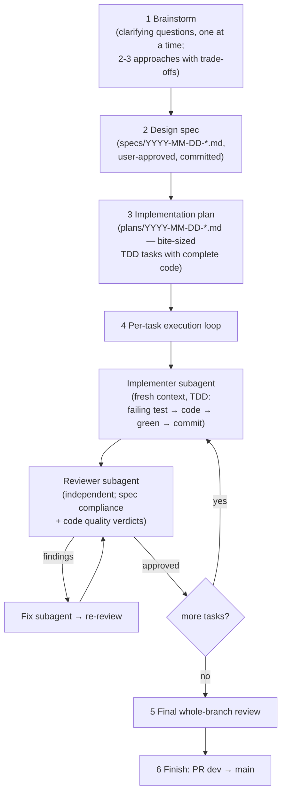

# How this repo is built: the "superpowers" workflow

This folder holds the design and planning artifacts produced by the AI-assisted development
workflow used in this repo (the [superpowers](https://github.com/anthropics/claude-plugins-official)
plugin for Claude Code). This page explains the process in plain terms so anyone on the team can
review not just the code, but *how the code came to be*.

## The pipeline, end to end

## What each phase produces

| Phase | Skill | Artifact | Reviewable by the team |
|---|---|---|---|
| Brainstorm | `superpowers:brainstorming` | decisions via Q&A (no artifact) | decisions recorded in the spec |
| Design | (same) | `specs/YYYY-MM-DD-<topic>-design.md` | goals, scope, architecture, acceptance criteria |
| Plan | `superpowers:writing-plans` | `plans/YYYY-MM-DD-<topic>.md` | every task, file, test, and command before any code exists |
| Execute | `superpowers:subagent-driven-development` | one conventional commit per task | `git log` maps 1:1 to plan tasks |
| Review | (same, reviewer subagents) | review verdicts per task | disagreements escalate to a human decision |
| Finish | `superpowers:finishing-a-development-branch` | PR from `dev` to `main` | normal PR review |

## Why it's shaped this way

- **Design before code.** The spec is written, self-reviewed, and human-approved *before* the plan;
  the plan is complete (real code, real commands) before execution. Scope changes happen in
  documents, where they're cheap.
- **Fresh context per task.** Each task is implemented by a subagent that sees only its task brief
  and the interfaces it needs — not the whole conversation. This keeps each change small, focused,
  and reproducible from the plan alone.
- **Independent review, every task.** A separate reviewer subagent (different context, explicitly
  told not to trust the implementer's report) checks each diff twice: *does it match the spec?*
  and *is it well built?* Critical/Important findings trigger a fix-and-re-review loop before the
  next task starts.
- **Humans decide the judgment calls.** When a reviewer flags something the plan itself mandated,
  the question goes to a human (example in this repo: whether the TMF error `code` field should
  duplicate the HTTP status — a teaching-simplification decision).
- **TDD throughout.** Every code task starts with a failing test; commits land only on a green
  suite. The commit history is the evidence trail.

## Current artifacts in this folder

- `specs/2026-07-20-living-things-catalog-design.md` + `plans/2026-07-20-living-things-catalog.md`
  — the original `vog-demo` application.
- `specs/2026-07-24-tmf620-tutorial-design.md` + `plans/2026-07-24-tmf620-tutorial.md`
  — the `vog-tmf` TMF620 Open API module and its tutorial.

To audit any feature: read its spec (what was agreed), then its plan (what was intended), then
`git log --oneline` over the matching commits (what was done — one commit per task, in plan order).
