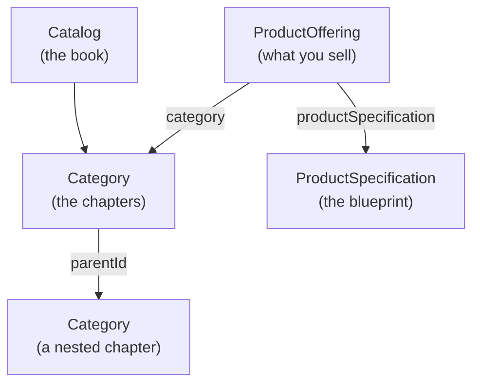
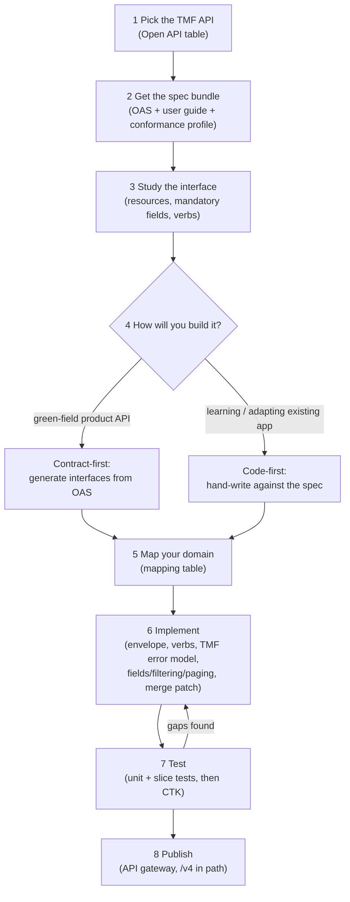

# Vog TMF — TM Forum Open API Tutorial (TMF620 Product Catalog)

This is a follow-along guide to `vog-tmf`: a second **Spring Boot** app (the
same Java web framework `vog-demo` is built on — it auto-configures a web
server, database access, and JSON handling) in this repository, exposing the
same kind of catalog data as `vog-demo`, but shaped according to a **TM Forum
Open API** instead of a home-grown one. It continues from the first tutorial
— the only background you need is
[`vog-demo/docs/TUTORIAL.md`](../../vog-demo/docs/TUTORIAL.md). You should
already have Java 17 active via `sdk env` (SDKMAN's project-scoped switch) and
the **Maven Wrapper** (`./mvnw`, the script committed in each project that
downloads the exact right Maven version) working, both from that guide's
Parts 2–3 — if `java -version` or `sdk env` mean nothing to you yet, start
there. Everything from that tutorial still applies here; this document only
adds what's *new*: the TM Forum rulebook.

> Convention: lines starting with `$` are commands you type (without the `$`).
> Everything else is expected output or explanation.

---

## Part 0 — What is TM Forum, and why Open APIs?

**TM Forum** is a global industry association for telecom operators (Telus,
Vodafone, AT&T, and hundreds more), their software vendors, and suppliers. It
doesn't sell software — it publishes shared standards so that the industry
isn't reinventing the same integrations, over and over, company by company.

### The interoperability problem

Picture a telecom operator that buys its billing system from one vendor, its
order-management system from another, and its product catalog from a third.
Each of those systems needs to talk to each other, and to dozens of partners.
Without a shared standard, every pair of systems needs its own bespoke
integration for concepts as ordinary as "here is a product" or "place an
order" — the same problem solved slightly differently N × M times across the
industry. Multiply that by every operator, every vendor, and every renewal
cycle, and integration cost dwarfs the cost of the actual feature.

### What's an Open API, in TM Forum's sense?

An **Open API** (in this context) is a published, versioned REST contract for
one business domain: TM Forum specifies the resource shapes, the URL
structure, and the behavior *once*, and any vendor or operator that implements
it to spec becomes interoperable with anyone else who also implements it — no
custom integration required. Each Open API is numbered; for example **TMF620
is the Product Catalog Management API** — it defines catalog, category,
product offering, and product specification resources. `vog-tmf` implements a
slice of TMF620. (You'll meet **TMF630** in Part 1 — that's not a business
domain, it's the common grammar every TM Forum Open API is written in.)

### ODA, in one paragraph

**ODA (Open Digital Architecture)** is TM Forum's reference architecture: a
catalog of reusable building blocks ("Components") that a telecom's IT estate
can be assembled from, each one exposing its functionality through Open APIs
instead of proprietary interfaces. Where TMF620 is one contract, ODA is the
bigger picture — how many such contracts fit together into a modular,
swappable system instead of a monolith.

### Conformance — why buyers ask for it

Building something that *looks* like TMF620 isn't the same as building
something that *is* TMF620 — a field named slightly differently, or a status
code that doesn't match, breaks the whole point of a shared standard. TM
Forum publishes a **Conformance Test Kit (CTK)** per API, and vendors can get
their implementation certified against it. That's why RFPs for telecom
software often require "TMF Open API Conformance Certified": it's the buyer's
evidence that a vendor's API genuinely follows the contract, not just
something that resembles it.

### Where the specs live

Two places, and this tutorial doesn't invent any others:

- **[tmforum.org/oda/open-apis](https://www.tmforum.org/oda/open-apis/)** — the
  human-readable catalog of every Open API family, organized by business
  domain.
- **[github.com/tmforum-apis](https://github.com/tmforum-apis)** — the
  machine-readable side: one GitHub repo per API, each with the OpenAPI
  Specification (OAS) YAML file, a user guide, and (for many APIs) a
  conformance profile.

That's the whole picture for Part 0: TM Forum publishes shared REST contracts
(Open APIs) so the industry stops re-solving the same integration problems;
ODA is how those contracts fit into a bigger architecture; conformance is how
you prove you actually followed one. From here on, this tutorial is about one
specific Open API — TMF620 — and the grammar (TMF630) it's written in.

---

## Part 1 — The TMF grammar (TMF630)

**TMF630** isn't a business domain like TMF620 — it's the *REST API Design
Guidelines* document: the conventions every TM Forum Open API shares, so that
once you've learned them for one API (TMF620 here), you already know most of
the shape of the next one (TMF622 Product Ordering, TMF666 Account
Management, and so on). This part walks through that shared grammar, building
up one field group at a time; Part 2 is where TMF620's specific resources
come in.

### The resource envelope: `id`, `href`, `@type`

Every resource a TMF API returns is wrapped in a small envelope that answers
"who am I, and what kind of thing am I":

- **`id`** — the resource's identifier (a string, even when the underlying
  storage uses a number).
- **`href`** — the full, dereferenceable URL for this exact resource.
- **`@type`** — the resource's TMF type name (`Category`, `ProductOffering`,
  `ProductSpecification`, …), so a client that receives a generic JSON blob
  still knows what it's looking at.

```json
{
  "id": "1",
  "href": "/tmf-api/productCatalogManagement/v4/category/1",
  "@type": "Category"
}
```

In `vog-tmf`, this envelope plus the resource's own fields is exactly what a
Java **record** represents — a concise, immutable class shape Jackson fills
straight from JSON, the same
[DTO](../../vog-demo/docs/SPRING-BOOT-DEV-GUIDE.md) idea as `vog-demo`'s
request/response shapes (kept separate from the shape that's actually stored
in the database). `CategoryTmf` is one such record, built from a JPA
[**entity**](../../vog-demo/docs/TUTORIAL.md) — a plain Java class mapped to a
database table, the same idea as `vog-demo`'s `Category`/`Organism` — whose
getters and setters are generated by [**Lombok**](../../vog-demo/docs/TUTORIAL.md)'s `@Getter`/`@Setter`
annotations, exactly as `vog-demo`'s entities already do. That entity is
stored in [**H2**](../../vog-demo/docs/TUTORIAL.md), the same in-memory database from the previous tutorial's
tools table, just under different table names (`tmf_category`, …) and with
TMF's field names instead of home-grown ones.

### `lifecycleStatus`

TMF resources track where they are in their life with a single string field,
`lifecycleStatus`. TM Forum defines a standard set of values so that "Active"
means the same thing across every vendor's implementation:

| Value | Meaning |
|---|---|
| `In study` | Being evaluated; not yet designed |
| `In design` | Being designed/built |
| `In test` | Being tested before launch |
| `Active` | Usable, but not yet publicly launched |
| `Launched` | Live and available |
| `Retired` | No longer offered, but historical data is kept |
| `Obsolete` | Fully retired; safe to ignore |

```json
{
  "id": "1",
  "href": "/tmf-api/productCatalogManagement/v4/category/1",
  "@type": "Category",
  "name": "Mobile",
  "lifecycleStatus": "Active"
}
```

### `validFor`

`validFor` is a reusable TMF630 shape — a validity window with a start and an
end — attached to almost every resource. In `vog-tmf` it's the `TimePeriod`
type (`startDateTime` / `endDateTime`), reused by every entity and DTO that
needs one:

```json
"validFor": {
  "startDateTime": "2026-01-01T00:00:00Z",
  "endDateTime": null
}
```

A `null` (or absent) `endDateTime` means "valid indefinitely, for now."

### `lastUpdate`

`lastUpdate` is a server-set timestamp — when this resource was last changed.
You never send it; it's stamped automatically (in `vog-tmf`, by Hibernate's
`@UpdateTimestamp` on the entity) and returned so clients can tell whether
their cached copy is stale.

### Putting it together: a full category

Combining everything above, a real response from `vog-tmf`'s seed data (`GET
/tmf-api/productCatalogManagement/v4/category/1`, the seeded "Mobile"
category) looks like this. Notice `parentId` and `validFor` are both missing:
this category has neither a parent nor a validity window set, and
`CategoryTmf` is annotated `@JsonInclude(NON_NULL)`, so any field with no
value is simply left out of the JSON rather than sent as `null`:

```json
{
  "id": "1",
  "href": "/tmf-api/productCatalogManagement/v4/category/1",
  "@type": "Category",
  "name": "Mobile",
  "description": "Mobile subscriptions and add-ons",
  "lifecycleStatus": "Active",
  "isRoot": true,
  "lastUpdate": "2026-07-24T14:02:11.123Z"
}
```

### The TMF error body

Every TMF API also standardizes its **error** shape, so a client only needs
one piece of error-handling code no matter which TMF API it's calling. A real
example from `vog-tmf` — asking for a category that doesn't exist:

```
GET /tmf-api/productCatalogManagement/v4/category/999
```
```json
{
  "code": "404",
  "reason": "Not Found",
  "message": "Category not found: 999",
  "status": "404"
}
```

This comes from a `TmfExceptionHandler` — the same idea as `vog-demo`'s
**global exception handler** (the `@RestControllerAdvice` box you saw in
[`TUTORIAL.md`'s Part 8 request-flow diagram](../../vog-demo/docs/TUTORIAL.md)):
one class, annotated `@RestControllerAdvice`, catching each exception type and
turning it into a consistent JSON body — just a different shape. Here's that
shape next to `vog-demo`'s `ApiError` (which you met via that same diagram):

| Field | `vog-tmf`'s `TmfError` | `vog-demo`'s `ApiError` |
|---|---|---|
| When it happened | — (not part of the TMF shape) | `timestamp` (an `Instant`) |
| HTTP status, as a number | `status` (string, e.g. `"404"`) | `status` (int, e.g. `404`) |
| An application/business error code | `code` (string) | — (not part of `ApiError`) |
| Human-readable HTTP phrase | `reason` (e.g. `"Not Found"`) | `error` (e.g. `"Not Found"`) |
| Explanation for this specific failure | `message` | `message` |
| Per-field validation details | folded into `message`, semicolon-joined | `details` (a `List<String>`) |

**A note on `code`.** In the TMF630 spec, `code` is meant to be an
*application-defined* business error code (something like `PROD-014` from a
company-maintained catalogue of error codes, richer and more specific than a
generic HTTP status) — it's deliberately a different concept from `status`.
`vog-tmf` simplifies this: `TmfError.of(...)` sets `code` to the same value as
`status` (the HTTP status number), so today `code` and `status` are always
identical. That's a fine simplification for a tutorial-sized app; a
production team implementing TMF620 would maintain a real error-code
catalogue and set `code` to the specific business code, independent of the
HTTP status.

### Verb semantics — and why PATCH, not PUT

| Verb | Meaning | Example |
|---|---|---|
| `GET` | Read one resource, or a filtered collection | `GET /category/1`, `GET /category?name=Mobile` |
| `POST` | Create a new resource | `POST /category` |
| `PATCH` | Partially update an existing resource | `PATCH /category/1` |
| `DELETE` | Remove a resource | `DELETE /category/1` |

You'll notice `PUT` is missing. `PUT` means "replace this whole resource with
exactly what I'm sending" — the client must resend *every* field, and any
field it omits (because it didn't know about it, or a newer API version
added it) gets wiped out. TMF630 mandates **`PATCH` with JSON Merge Patch**
(RFC 7386) instead: a field that's *absent* from the patch body is left
alone, a field set to a *value* is replaced, and a field explicitly set to
`null` is cleared. `vog-tmf`'s `CategoryController` wires this up literally —
`@PatchMapping(consumes = "application/merge-patch+json")`.

For example, patching the "Mobile" category's description and lifecycle,
leaving everything else untouched:

Before (`GET /category/1`):
```json
{
  "id": "1",
  "href": "/tmf-api/productCatalogManagement/v4/category/1",
  "@type": "Category",
  "name": "Mobile",
  "description": "Mobile subscriptions and add-ons",
  "lifecycleStatus": "Active",
  "isRoot": true
}
```

Patch request (`PATCH /category/1`, `Content-Type:
application/merge-patch+json`):
```json
{
  "description": "Mobile subscriptions, add-ons, and roaming bundles",
  "lifecycleStatus": "Launched"
}
```

After:
```json
{
  "id": "1",
  "href": "/tmf-api/productCatalogManagement/v4/category/1",
  "@type": "Category",
  "name": "Mobile",
  "description": "Mobile subscriptions, add-ons, and roaming bundles",
  "lifecycleStatus": "Launched",
  "isRoot": true
}
```

`name` and `isRoot` weren't in the patch body, so they're unchanged; `name`
being *sent as `null`* would instead be rejected — `vog-tmf`'s `CategoryService`
treats `name` as mandatory and throws rather than clearing it.

### Partial responses, filtering, and paging

Three more TMF630 conventions, all visible on `vog-tmf`'s collection
endpoints (e.g. `GET /category`):

- **`?fields=`** — a partial response: ask for only the fields you need
  (`?fields=name,lifecycleStatus`), and the server returns just those, plus
  the envelope (`id`, `href`, `@type`), which is always kept regardless of
  what you asked for.
- **Query filtering** — plain query parameters filter the collection, e.g.
  `?name=Mobile&lifecycleStatus=Active` returns only categories matching both.
- **`offset` / `limit`** — pagination: `offset` is how many matching items to
  skip, `limit` is the page size (`vog-tmf` defaults to `offset=0&limit=20`).
- **`X-Total-Count`** — a response header with the *total* number of items
  matching the filter (not just this page); **`X-Result-Count`** — how many
  items are actually in this response body. When those two differ (there's
  more data than fits in this page), the response status is **206 Partial
  Content** instead of 200 — a signal to the client that it needs another
  page.

That's the whole TMF630 grammar this tutorial needs: an envelope, a lifecycle
vocabulary, a validity window, a consistent error shape, `PATCH`-with-merge-
patch instead of `PUT`, and a small set of query conventions for filtering
and paging. Every TMF620 resource in Part 2 reuses all of it.

---

## Part 2 — TMF620, the Product Catalog API

TMF620 is the Product Catalog Management API — the specific business domain
`vog-tmf` implements, using the TMF630 grammar from Part 1. It has four core
concepts:

| Concept | Plain-language one-liner |
|---|---|
| **catalog** | The book — the top-level container that everything else sits inside. |
| **category** | The chapters — how offerings are organized and browsed (and categories can nest). |
| **productOffering** | What you sell — a concrete, priceable thing a customer can buy. |
| **productSpecification** | The blueprint of what you sell — the technical/attribute definition an offering is built from. |

Each of the three we implement is exposed through its own
[**`@RestController`**](../../vog-demo/docs/TUTORIAL.md) — the "front desk"
annotation that maps URLs to Java methods, the same pattern as `vog-demo`'s
`OrganismController` — mounted under
`/tmf-api/productCatalogManagement/v4/{category|productOffering|productSpecification}`.

### How they relate



A `productOffering` points to exactly one `productSpecification` (what it's
built from) and to one or more `category` entries (how it's browsed); a
`category` can point to a parent `category` to form a hierarchy. `vog-tmf`'s
three seeded categories ("Mobile", "Internet", "Business") are all top-level
roots with no parent; in Part 4, you'll create a child category to see the
parent relationship in action. A `catalog` is the umbrella that organizes categories
— conceptually the top of the tree.

### What we implemented — and what we only mention

`vog-tmf` implements a deliberately focused slice of TMF620, enough to
demonstrate every TMF630 pattern from Part 1 without building out the entire
spec:

| Resource | Status in `vog-tmf` |
|---|---|
| `category` | Implemented — full CRUD + patch (Part 1's examples). |
| `productSpecification` | Implemented — full CRUD + patch. |
| `productOffering` | Implemented — full CRUD + patch, referencing a spec and categories. |
| `catalog` | Not implemented — conceptually the container above `category`; adding it is the same pattern as `category`, just one more layer. |
| `productOfferingPrice` | Not implemented — TMF620 splits pricing into its own resource; out of scope here to keep the tutorial focused on catalog structure, not pricing rules. |
| Hub / events (event notification) | Not implemented — TMF620 defines a webhook-style subscription mechanism for "notify me when a resource changes"; a real integration would add this, but it's a separate concern from the CRUD grammar this tutorial teaches. |
| `importJob` / `exportJob` | Not implemented — bulk import/export of catalog data; useful operationally, but adds nothing new to the request/response grammar already covered. |

Each of the resources we skipped follows the *same* TMF630 patterns you
already know from Part 1 — the reason to stop here is scope, not difficulty.

### The TMF implementation workflow at a glance

Zooming out from TMF620 specifically: here's the quick-reference version of
how you'd implement *any* TM Forum Open API, with a pointer to where each
step is covered in depth.

1. **Pick the API** — find your business domain in the TM Forum Open API
   table (Part 0's links).
2. **Get the spec bundle** — the OAS file, user guide, and conformance
   profile for that API.
3. **Study the interface** — resources, mandatory fields, verbs, lifecycle
   values (Parts 1–2, this document).
4. **Choose code-first vs. contract-first** (Part 6).
5. **Map your domain** — a mapping table from your own model to the TMF
   resources (Part 7's technique).
6. **Implement** — the envelope, verbs, error model, and other TMF630
   patterns (Part 3).
7. **Test** — unit and slice tests, then the Conformance Test Kit (CTK)
   (Part 5).
8. **Publish** — expose it behind the API gateway, with the version in the
   path (Parts 6–7).



`vog-tmf` itself is the worked example of this loop: it picked TMF620,
studied TMF630 and TMF620's resources (Parts 0–2, above), and — as the parts
ahead in this tutorial pick back up — implements, tests (including with
[**MockMvc**](../../vog-demo/docs/TUTORIAL.md)-based controller tests, the
same tool `vog-demo`'s tests use to call endpoints without a real HTTP
server), and publishes it on port 8081, browsable the same way as
`vog-demo` — via [**Swagger UI**](../../vog-demo/docs/TUTORIAL.md)
(generated by **springdoc**, the same library, at
`http://localhost:8081/swagger-ui.html`) — with
`/tmf-api/productCatalogManagement/v4` in the path.

---

## Part 3 — Build it from scratch

Parts 0–2 explained the *shape* of a TMF Open API. This part walks the actual
`vog-tmf` source, package by package, in the order you'd build it: the shared
TMF plumbing first, then the JPA storage layer, the JSON-facing shapes, the
business logic, and finally the HTTP front door. Each section only calls out
what's *new* relative to `vog-demo` — the rest (Spring wiring, constructor
injection, Lombok getters/setters) is the same pattern you already know.

### `tmf/` — the shared TMF plumbing

This package holds the handful of types every resource reuses, so `category`,
`productOffering`, and `productSpecification` don't each reinvent them.
`TmfApi` is the smallest of the lot — one constant, the shared URL prefix:

```java
public final class TmfApi {
    public static final String BASE_PATH = "/tmf-api/productCatalogManagement/v4";
}
```

`TmfError` is the error shape from Part 1, with a factory method that turns
an HTTP status and a message into the four-field body:

```java
public record TmfError(String code, String reason, String message, String status) {
    public static TmfError of(HttpStatus status, String message) {
        return new TmfError(String.valueOf(status.value()), status.getReasonPhrase(),
                message, String.valueOf(status.value()));
    }
}
```

`PageWindow<T>` is a tiny record — one page of results plus the *total*
matching count, which is exactly the two numbers the controller needs to
decide between `200` and `206`:

```java
public record PageWindow<T>(List<T> items, long total) {
}
```

`FieldsFilter` implements `?fields=` (Part 1's partial response): it turns a
DTO into a JSON tree, then keeps only the requested properties plus the
envelope that's never allowed to disappear:

```java
private static final Set<String> ALWAYS_KEPT = Set.of("id", "href", "@type");

public static ObjectNode apply(ObjectMapper mapper, Object dto, String fieldsParam) {
    ObjectNode full = (ObjectNode) mapper.valueToTree(dto);
    if (fieldsParam == null || fieldsParam.isBlank()) {
        return full;
    }
    Set<String> keep = new HashSet<>(ALWAYS_KEPT);
    for (String field : fieldsParam.split(",")) {
        keep.add(field.trim());
    }
    ObjectNode out = mapper.createObjectNode();
    for (Map.Entry<String, JsonNode> property : full.properties()) {
        if (keep.contains(property.getKey())) {
            out.set(property.getKey(), property.getValue());
        }
    }
    return out;
}
```

And `TimePeriod` is the `validFor` shape from Part 1 — a plain
`@Embeddable` with a start and an end, reused by every entity below.

### `entity/` — JPA, with a couple of TMF-shaped choices

If you haven't met JPA entities yet, `vog-demo`'s
[**entity**](../../vog-demo/docs/TUTORIAL.md) refresher covers the basics —
`@Entity`, `@Id`, `@GeneratedValue`. `vog-tmf`'s three entities
(`Category`, `ProductOffering`, `ProductSpecification`) follow that same
pattern, with three things worth calling out because they're new here:

- **`@Embedded TimePeriod validFor`** — `Category`, `ProductOffering`, and
  `ProductSpecification` each embed a `TimePeriod` for their `validFor`
  window. `@Embedded` (paired with `@Embeddable` on `TimePeriod` itself)
  tells Hibernate to inline that object's columns into the owning table,
  rather than create a separate one — one reusable Java type, no repeated
  `startDateTime`/`endDateTime` columns hand-copied into every entity.
- **`@UpdateTimestamp private Instant lastUpdate`** — Hibernate stamps this
  column automatically on every insert and update; nothing in `vog-tmf`'s
  code ever calls `setLastUpdate(...)`. This is what backs the `lastUpdate`
  field from Part 1.
- **A self-referencing `@ManyToOne`** — `Category` points at its own parent:

```java
@ManyToOne
@JoinColumn(name = "parent_id")
private Category parent;
```

  Many categories can share one parent, and a category has at most one
  parent — the same `@ManyToOne` annotation you'd use to point at any other
  entity, just pointing back at `Category` itself. That's how the "chapters
  and nested chapters" hierarchy from Part 2's diagram is actually stored.

`ProductOffering` adds one more new mapping — a **`@ManyToMany`** to
`Category`, because one offering can be browsable under several categories,
and one category holds many offerings:

```java
@ManyToMany
@JoinTable(name = "tmf_offering_category",
        joinColumns = @JoinColumn(name = "offering_id"),
        inverseJoinColumns = @JoinColumn(name = "category_id"))
private Set<Category> categories = new LinkedHashSet<>();
```

Unlike the two `@ManyToOne`s you've seen so far (each stored as a single
foreign-key column on the "many" side), a many-to-many relationship can't
live in either table alone — `@JoinTable` tells Hibernate to create a third,
purely-linking table (`tmf_offering_category`, one row per offering/category
pairing) to hold it.

### `dto/` — records, JSON shaping, and the `*Ref` pattern

If records or the DTO/entity split are new to you, `vog-demo`'s
[**DTO**](../../vog-demo/docs/SPRING-BOOT-DEV-GUIDE.md) refresher covers the
"why" — Java `record`s as concise, immutable response shapes, kept separate
from what's actually stored. Every TMF resource DTO here is a `record` built
by a static `from(entity)` factory, same as Part 1's `CategoryTmf`:

```java
@JsonInclude(JsonInclude.Include.NON_NULL)
public record CategoryTmf(
        String id,
        String href,
        @JsonProperty("@type") String type,
        String name,
        String description,
        String lifecycleStatus,
        Boolean isRoot,
        String parentId,
        TimePeriod validFor,
        Instant lastUpdate) {
    // from(Category entity) builds one of these, id/href/type computed,
    // everything else copied straight off the entity's getters
}
```

Two annotations do the JSON shaping from Part 1: **`@JsonProperty("@type")`**
renames the `type` component to the TMF field name `@type` (a Java
identifier can't contain `@`, so the component is named `type` in code and
relabeled on the wire), and **`@JsonInclude(NON_NULL)`** — put on the whole
record — drops any component that's `null` from the output entirely, instead
of serializing it as `"field": null`. That's why the "Mobile" category
example back in Part 1 shows no `parentId` or `validFor` key at all when
those are unset.

The last new idea is the **`*Ref` pattern** — how one TMF resource points at
another without embedding the whole thing. `ProductOffering` references a
`ProductSpecification` and one or more `Category` entries; rather than
nesting a full `ProductSpecificationTmf`/`CategoryTmf` (with *its* nested
references, and so on, forever), it nests a small "reference" record — just
enough to identify the thing and let the client dereference it if it wants
to:

```java
public record CategoryRef(
        String id,
        String href,
        String name,
        @JsonProperty("@referredType") String referredType) {

    public static CategoryRef from(Category entity) {
        String id = String.valueOf(entity.getId());
        return new CategoryRef(id, TmfApi.BASE_PATH + "/category/" + id, entity.getName(), "Category");
    }
}
```

`ProductSpecificationRef` is the same shape for the other reference.
`ProductOfferingTmf` embeds one `ProductSpecificationRef` and a
`List<CategoryRef>` — a link, not a copy.

### `service/` — merge patch, filtering, and windowing

`CategoryService.patch` is the clearest place to see JSON Merge Patch (Part
1) actually implemented. It's handed a raw `JsonNode` — the parsed request
body — and walks each patchable field, one `if (patch.has(fieldName))` at a
time:

```java
public CategoryTmf patch(Long id, JsonNode patch) {
    Category entity = findOrThrow(id);
    if (patch.has("name")) {
        if (patch.get("name").isNull()) {
            throw new InvalidInputException("name is mandatory and cannot be removed");
        }
        entity.setName(patch.get("name").asString());
    }
    if (patch.has("description")) {
        entity.setDescription(patch.get("description").isNull() ? null : patch.get("description").asString());
    }
    // ...lifecycleStatus, isRoot follow the same pattern
    return CategoryTmf.from(categories.save(entity));
}
```

That's the three merge-patch outcomes from Part 1, in code: a field the
patch body doesn't mention (`patch.has(...)` is `false`) is never touched; a
field present but set to JSON `null` clears it (except `name`, which
`CategoryService` treats as mandatory and rejects instead — a business rule
layered on top of the generic merge semantics); a field present with a real
value replaces it. `ProductOfferingService.patch` and
`ProductSpecificationService.patch` follow the identical shape for their own
fields.

`list` is where filtering and paging (also Part 1) happen, and it's a plain
Java `Stream` pipeline over everything the repository returns:

```java
public PageWindow<CategoryTmf> list(String name, String lifecycleStatus, int offset, int limit) {
    List<CategoryTmf> matching = categories.findAll().stream()
            .filter(c -> name == null || name.equals(c.getName()))
            .filter(c -> lifecycleStatus == null || lifecycleStatus.equals(c.getLifecycleStatus()))
            .map(CategoryTmf::from)
            .toList();
    List<CategoryTmf> window = matching.stream().skip(offset).limit(limit).toList();
    return new PageWindow<>(window, matching.size());
}
```

Every query parameter is an optional `.filter(...)` (skipped when `null`),
then `.skip(offset).limit(limit)` slices out the requested page, and the
*pre-slice* size becomes `PageWindow.total()` — the number the controller
compares against the page size to decide `200` vs. `206`. **A note on
scale:** loading the whole table into memory and filtering it in Java is
fine for a tutorial-sized catalog; a production implementation would push
`name`/`lifecycleStatus` filtering down into the database instead — Spring
Data query derivation (`findByNameAndLifecycleStatus(...)`) or the
[`Specification`](https://docs.spring.io/spring-data/jpa/reference/jpa/specifications.html)
API for dynamic filters — so the database does the narrowing before any rows
cross into the JVM.

### `controller/` — the front desk, TMF-shaped

Each of `vog-tmf`'s three controllers is a
[**`@RestController`**](../../vog-demo/docs/TUTORIAL.md) exactly like
`vog-demo`'s, with three TMF-specific response-building choices worth
tracing through:

**201 + `Location`**, on create — `ResponseEntity.created(...)` sets both
the status and the header from the DTO's own computed `href`:

```java
@PostMapping
public ResponseEntity<CategoryTmf> create(@Valid @RequestBody CategoryCreate request) {
    CategoryTmf created = service.create(request);
    return ResponseEntity.created(URI.create(created.href())).body(created);
}
```

**206 + count headers**, on list — the status is picked at request time by
comparing the page returned against the total that matched:

```java
PageWindow<CategoryTmf> page = service.list(name, lifecycleStatus, offset, limit);
List<ObjectNode> body = page.items().stream()
        .map(item -> FieldsFilter.apply(mapper, item, fields))
        .toList();
HttpStatus status = body.size() < page.total() ? HttpStatus.PARTIAL_CONTENT : HttpStatus.OK;
return ResponseEntity.status(status)
        .header("X-Total-Count", String.valueOf(page.total()))
        .header("X-Result-Count", String.valueOf(body.size()))
        .body(body);
```

Notice `FieldsFilter.apply` runs right here, per item, before the response
is built — the `?fields=` projection from Part 1 happening at the very last
step, after filtering and paging are already done.

**`consumes = "application/merge-patch+json"`**, on patch — the content
type is part of the mapping itself, so a client that `PATCH`es with the
wrong `Content-Type` gets a routing failure, not a silently-misapplied
patch:

```java
@PatchMapping(path = "/{id}", consumes = "application/merge-patch+json")
public CategoryTmf patch(@PathVariable Long id, @RequestBody JsonNode patch) {
    return service.patch(id, patch);
}
```

### A note on Jackson 3

You'll notice two different Jackson package roots across this codebase:
`tools.jackson.databind.*` (`ObjectMapper`, `JsonNode`, `ObjectNode`) in
`FieldsFilter`, the services, and the controllers — and
`com.fasterxml.jackson.annotation.*` (`@JsonProperty`, `@JsonInclude`) on the
DTOs. That's not a typo. Spring Boot 4 moved its default JSON engine to
**Jackson 3**, whose databind module was renamed to the `tools.jackson`
group — one more example of the Boot 4 modularization this repo's
[memory note on Boot 4 test slices](../../vog-demo/docs/SPRING-BOOT-DEV-GUIDE.md)
already flagged for a different package. The small `jackson-annotations`
module (just the annotation types, no databind logic) kept its original
`com.fasterxml.jackson.annotation` coordinates through that move, so it's
imported unchanged everywhere a DTO needs `@JsonProperty` or
`@JsonInclude`.

---

## Part 4 — Run and verify

### Prerequisites

You need Java 17 active — the same **SDKMAN** project-scoped switch
(`sdk env`) from the first tutorial's
[Part 2](../../vog-demo/docs/TUTORIAL.md), and the same **Maven Wrapper**
(`./mvnw`) working. Both instructions apply unchanged here; `vog-tmf` is a
sibling Maven project with its own `./mvnw`.

### Start it

```bash
$ cd vog-tmf && source "$HOME/.sdkman/bin/sdkman-init.sh" && sdk env
Using java version 17.0.19-tem in this shell.
$ ./mvnw spring-boot:run
```

Once the log settles ("Started VogTmfApplication..."), the app is listening
on port **8081** (not 8080 — that's `vog-demo`'s port, and both can run
side by side; the adapter demo at the end of this part needs exactly that).
`DataSeeder` has already populated 3 categories, 2 product specifications,
and 4 product offerings, so every curl below returns real data on a fresh
start.

### The curl walkthrough

```bash
BASE=http://localhost:8081/tmf-api/productCatalogManagement/v4
```

**1. List categories — the seeded envelope, visible end to end:**

```bash
$ curl -s $BASE/category | jq
```
```json
[
  {
    "id": "1",
    "href": "/tmf-api/productCatalogManagement/v4/category/1",
    "@type": "Category",
    "name": "Mobile",
    "description": "Mobile subscriptions and add-ons",
    "lifecycleStatus": "Active",
    "isRoot": true,
    "lastUpdate": "2026-07-24T17:15:55.724694Z"
  },
  { "id": "2", "name": "Internet", ... },
  { "id": "3", "name": "Business", ... }
]
```

**2. Create a category — 201 + `Location`:**

```bash
$ curl -s -i -X POST $BASE/category -H 'Content-Type: application/json' \
    -d '{"name":"TV","description":"Television offers"}'
```
```
HTTP/1.1 201
Location: /tmf-api/productCatalogManagement/v4/category/4

{"id":"4","href":".../category/4","@type":"Category","name":"TV",
 "description":"Television offers","lifecycleStatus":"In study","isRoot":true, ...}
```

Note `lifecycleStatus` defaulted to `"In study"` — you didn't send one, and
`CategoryService.create` fills that in.

**2b. Create a *child* category — the `parentId` example Part 2 promised.**
Point a new category's `parentId` at the "Mobile" category you just listed
(`id: "1"`):

```bash
$ curl -s -i -X POST $BASE/category -H 'Content-Type: application/json' \
    -d '{"name":"Mobile Postpaid","description":"Postpaid mobile plans","parentId":"1"}'
```
```
HTTP/1.1 201
Location: /tmf-api/productCatalogManagement/v4/category/5

{"id":"5","href":".../category/5","@type":"Category","name":"Mobile Postpaid",
 "description":"Postpaid mobile plans","lifecycleStatus":"In study","isRoot":false,
 "parentId":"1", ...}
```

Fetching it back by itself confirms `parentId` round-trips through a plain
`GET`, exactly like every other field:

```bash
$ curl -s $BASE/category/5 | jq
```
```json
{
  "id": "5",
  "href": "/tmf-api/productCatalogManagement/v4/category/5",
  "@type": "Category",
  "name": "Mobile Postpaid",
  "description": "Postpaid mobile plans",
  "lifecycleStatus": "In study",
  "isRoot": false,
  "parentId": "1",
  "lastUpdate": "2026-07-24T17:16:13.779695Z"
}
```

That's the `ParentCat -->|parentId| ChildCat` edge from Part 2's diagram, made
real. **One thing worth noticing:** `isRoot` comes back `false` here even
though you never set it — `CategoryService.create` derives `isRoot` from
whether a `parentId` was given whenever the request doesn't set `isRoot`
explicitly, so the two fields stay consistent without you having to think
about it.

**3. Partial response — only the requested fields, envelope included:**

```bash
$ curl -s "$BASE/productOffering?fields=name,lifecycleStatus" | jq
```
```json
[
  {
    "id": "1",
    "href": "/tmf-api/productCatalogManagement/v4/productOffering/1",
    "@type": "ProductOffering",
    "name": "Mobile 5G Unlimited",
    "lifecycleStatus": "Active"
  },
  { "id": "2", "name": "Mobile 5G Basic", "lifecycleStatus": "Active" },
  { "id": "3", "name": "Fibre Gigabit Home", "lifecycleStatus": "Active" },
  { "id": "4", "name": "Business Fibre 1G", "lifecycleStatus": "Active" }
]
```

Only `name` and `lifecycleStatus` came through, plus `id`/`href`/`@type` —
`description`, `isBundle`, `productSpecification`, `category`, and the rest
are all gone, exactly as `FieldsFilter` promised.

**4. Query filtering — `lifecycleStatus=Active` (everything, here, since all
four seeded offerings are `Active`), showing the full `*Ref` shapes:**

```bash
$ curl -s "$BASE/productOffering?lifecycleStatus=Active" | jq
```
```json
[
  {
    "id": "1",
    "name": "Mobile 5G Unlimited",
    "productSpecification": {
      "id": "1", "href": ".../productSpecification/1",
      "name": "5G SIM-Only Spec", "@referredType": "ProductSpecification"
    },
    "category": [
      { "id": "1", "href": ".../category/1", "name": "Mobile", "@referredType": "Category" }
    ]
  },
  ...
]
```

**5. Paging — `offset=0&limit=2` over 4 total offerings → 206:**

```bash
$ curl -s -i "$BASE/productOffering?offset=0&limit=2"
```
```
HTTP/1.1 206
X-Total-Count: 4
X-Result-Count: 2

[{"id":"1","name":"Mobile 5G Unlimited", ...},{"id":"2","name":"Mobile 5G Basic", ...}]
```

Two items came back out of four that matched — `X-Total-Count` (4) is
greater than `X-Result-Count` (2), so the status is `206 Partial Content`,
signaling there's another page.

**6. Merge patch — clear one field, replace another, leave the rest:**

```bash
$ curl -s -X PATCH $BASE/category/1 -H 'Content-Type: application/merge-patch+json' \
    -d '{"description":null,"lifecycleStatus":"Launched"}' | jq
```
```json
{
  "id": "1",
  "href": "/tmf-api/productCatalogManagement/v4/category/1",
  "@type": "Category",
  "name": "Mobile",
  "lifecycleStatus": "Launched",
  "isRoot": true,
  "lastUpdate": "2026-07-24T17:15:55.724694Z"
}
```

`description` is gone from the response entirely (it was cleared to `null`,
and `@JsonInclude(NON_NULL)` drops it), `lifecycleStatus` is now
`"Launched"`, and `name`/`isRoot` — untouched by the patch body — are
exactly what they were before.

**7. The TMF error body — a category that doesn't exist:**

```bash
$ curl -s $BASE/category/999 | jq
```
```json
{
  "code": "404",
  "reason": "Not Found",
  "message": "Category not found: 999",
  "status": "404"
}
```

**8. The retrofit adapter — `vog-demo`'s legacy categories, wrapped as TMF.**
This one needs `vog-demo` running too, on its usual port 8080 (a second
terminal, `cd vog-demo && sdk env && ./mvnw spring-boot:run`):

```bash
$ curl -s $BASE/legacyCategory | jq
```
```json
[
  {
    "id": "1",
    "href": "/tmf-api/productCatalogManagement/v4/legacyCategory/1",
    "@type": "Category",
    "name": "Mammal",
    "description": "Warm-blooded vertebrates with hair or fur",
    "lifecycleStatus": "Active",
    "isRoot": true
  },
  { "id": "2", "name": "Fish", ... },
  ...
]
```

`vog-demo`'s eight seeded organism categories (`Mammal`, `Fish`, `Bird`, ...)
come back shaped like TMF `Category` resources — `LegacyCategoryAdapterController`
did the wrapping, with `lifecycleStatus` and `isRoot` filled in with safe
defaults since the legacy model has neither.

Now stop `vog-demo` (Ctrl-C in its terminal) and repeat the same request —
this is the two-terminal setup the adapter demo is built around, showing
what happens when the downstream is actually down:

```bash
$ curl -s -i $BASE/legacyCategory
```
```
HTTP/1.1 503

{
  "code": "503",
  "reason": "Service Unavailable",
  "message": "Legacy catalog (vog-demo) unreachable: I/O error on GET request for \"http://localhost:8080/api/categories\": null",
  "status": "503"
}
```

Same `TmfError` shape as the 404 above — a client written against this API
handles every failure mode, downstream outages included, with one piece of
error-handling code.

### Browsing it

**Swagger UI** is at `http://localhost:8081/swagger-ui.html` — the same
[springdoc](../../vog-demo/docs/TUTORIAL.md)-generated explorer as
`vog-demo`'s, listing all three controllers with their request/response
schemas, useful for poking at endpoints without hand-typing curl.

---

## Part 5 — Testing a TMF API

### The test pyramid, recapped

`vog-demo`'s first tutorial introduced
[running the automated tests](../../vog-demo/docs/TUTORIAL.md) (`./mvnw
test`) and the layered idea behind them: many fast unit/slice tests at the
bottom, fewer broader integration tests above that, fewer still full
end-to-end tests at the top. `vog-tmf` follows the same shape — 43 tests
today, almost all of them fast Mockito-backed service tests and
`@WebMvcTest` controller slices, with a handful of `@DataJpaTest` and one
full `@SpringBootTest` for the seeding check.

### The frameworks, one line each

All of them arrive via `spring-boot-starter-test`, the same starter
`vog-demo` uses:

| Framework | Role in these tests |
|---|---|
| **JUnit 5** | The test runner — `@Test`, lifecycle, assertions failing the build. |
| **AssertJ** | Fluent assertions — `assertThat(x).isEqualTo(y)`, `assertThatThrownBy(...)`. |
| **Mockito** | Fakes collaborators — `@Mock`/`@InjectMocks` for service tests, `@MockitoBean` inside `@WebMvcTest`. |
| **MockMvc** | Drives a controller through Spring's request-handling machinery without a real HTTP server. |
| **JsonPath** | `jsonPath("$.field")` assertions on the JSON MockMvc got back, without hand-parsing it. |

### What's TMF-specific to test

Everything above is generic Spring testing; here's how the TMF630/TMF620
concepts from Parts 1–3 map onto real test methods in `vog-tmf`:

| TMF concept | Test(s) |
|---|---|
| Envelope (`id`/`href`/`@type`) present on create | `CategoryControllerTest.post_returns201WithLocationAndEnvelope`, and the equivalent in `ProductOfferingControllerTest`/`ProductSpecificationControllerTest` |
| TMF error body, not a generic Spring one | `CategoryControllerTest.post_missingName_returns400TmfError`, `get_unknownId_returns404TmfError` |
| Merge patch: absent = keep, `null` = clears the field | `CategoryServiceTest.patch_appliesMergeSemantics_nullClearsField`, `ProductOfferingServiceTest.patch_appliesMergeSemantics_nullClearsDescription` |
| Merge patch: `name` can't be nulled out | `ProductOfferingServiceTest.patch_nullName_throwsInvalidInput` |
| `?fields=` projection keeps the envelope | `CategoryControllerTest.list_fieldsParam_projectsButKeepsEnvelope` (same pattern in the other two controllers), plus the focused `FieldsFilterTest` |
| `206` + `X-Total-Count`/`X-Result-Count` | `list_partialPage_returns206WithCountHeaders` in each controller test |
| Self-referencing parent + `@UpdateTimestamp` | `CategoryRepositoryTest.savesSelfReferencingParentAndAutoStampsLastUpdate` |
| Adapter: downstream unreachable → `DownstreamUnavailableException` | `LegacyCatalogClientTest.fetchCategories_connectionFailure_throwsDownstreamUnavailable`, using `MockRestServiceServer` + `withException(new IOException(...))` to simulate the connection failure without a real network call |
| Adapter: that exception becomes a TMF `503` | `LegacyCategoryAdapterControllerTest.list_downstreamDown_returns503TmfError` |
| Seed data shape (3 categories / 2 specs / 4 offerings) | `DataSeederTest.seedsCatalogOnStartup` — the one full `@SpringBootTest` in the suite |

### Best practices worth calling out

- **Test the contract, not the implementation.** Every assertion above
  checks status codes, headers, and JSON shape — what a client actually
  sees — never Java internals.
- **One behaviour per test.** `CategoryControllerTest` alone has seven
  separate methods, each proving exactly one thing (201+envelope, 400 on
  missing name, 404 on unknown id, 206 paging, `fields=` projection,
  merge-patch content type, 204 delete) rather than one giant test asserting
  everything at once.
- **Slices over `@SpringBootTest`.** `@WebMvcTest(CategoryController.class)`
  boots only the web layer (with the service mocked via `@MockitoBean`);
  `@DataJpaTest` boots only the JPA layer. Both start in a fraction of a
  second compared to a full application context — see this repo's
  [per-technology test-slice packages note](../../vog-demo/docs/SPRING-BOOT-DEV-GUIDE.md)
  for why Boot 4 moved these annotations into their own starters
  (`spring-boot-starter-webmvc-test`, `spring-boot-starter-data-jpa-test`,
  both present in `vog-tmf`'s `pom.xml`). `@SpringBootTest` is reserved for
  the one place a real context earns its cost: proving `DataSeeder` actually
  runs on startup.
- **Deterministic test data — never rely on `DataSeeder`.** Every service
  and controller test builds its own fixtures (`saved(...)`, `tmf(...)`
  helper methods, Mockito stubs) rather than depending on what
  `DataSeeder` happens to have inserted. `DataSeederTest` is the *only* test
  that asserts anything about the seeded rows — everything else would keep
  passing even if the seed data changed shape entirely.

### The production ladder

`vog-tmf`'s test suite is a solid foundation; a production TMF620
implementation typically layers a few more tools on top:

- **[Testcontainers](https://testcontainers.com/)** — runs real Postgres (or
  whatever the production database is) in a throwaway Docker container for
  integration tests, instead of H2 standing in for it.
- **[REST Assured](https://rest-assured.io/)** — a fluent library for
  testing a *running* HTTP API end to end (as opposed to MockMvc's in-process
  simulation), useful once you're testing a deployed instance.
- **[Pact](https://pact.io/)** — consumer-driven contract testing, so a
  client team and this API's team can each verify their side of an
  integration without either standing up the other's full system.
- **The TMF Conformance Test Kit (CTK)** — mentioned back in Part 0 — is the
  final rung: the official suite a vendor runs to get "TMF Open API
  Conformance Certified," checking the implementation against the spec
  itself rather than against hand-written expectations.
