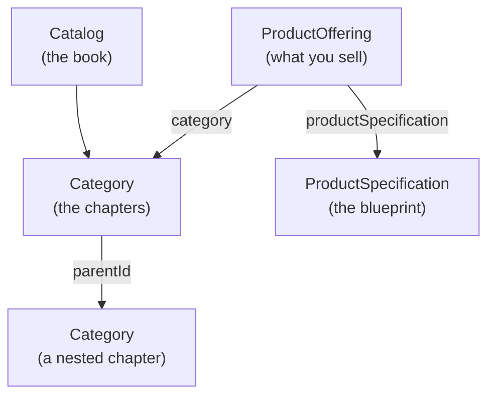
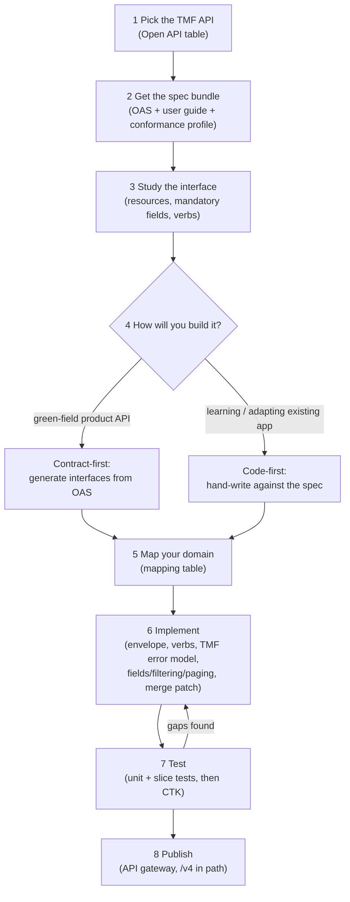

# Vog TMF — TM Forum Open API Tutorial (TMF620 Product Catalog)

This is a follow-along guide to `vog-tmf`: a second **Spring Boot** app (the
same Java web framework `vog-demo` is built on — it auto-configures a web
server, database access, and JSON handling) in this repository, exposing the
same kind of catalog data as `vog-demo`, but shaped according to a **TM Forum
Open API** instead of a home-grown one. It continues from the first tutorial
— the only background you need is
[`vog-demo/docs/TUTORIAL.md`](../../vog-demo/docs/TUTORIAL.md). You should
already have Java 17 active via `sdk env` (SDKMAN's project-scoped switch) and
the **Maven Wrapper** (`./mvnw`, the script committed in each project that
downloads the exact right Maven version) working, both from that guide's
Parts 2–3 — if `java -version` or `sdk env` mean nothing to you yet, start
there. Everything from that tutorial still applies here; this document only
adds what's *new*: the TM Forum rulebook.

> Convention: lines starting with `$` are commands you type (without the `$`).
> Everything else is expected output or explanation.

---

## Part 0 — What is TM Forum, and why Open APIs?

**TM Forum** is a global industry association for telecom operators (Telus,
Vodafone, AT&T, and hundreds more), their software vendors, and suppliers. It
doesn't sell software — it publishes shared standards so that the industry
isn't reinventing the same integrations, over and over, company by company.

### The interoperability problem

Picture a telecom operator that buys its billing system from one vendor, its
order-management system from another, and its product catalog from a third.
Each of those systems needs to talk to each other, and to dozens of partners.
Without a shared standard, every pair of systems needs its own bespoke
integration for concepts as ordinary as "here is a product" or "place an
order" — the same problem solved slightly differently N × M times across the
industry. Multiply that by every operator, every vendor, and every renewal
cycle, and integration cost dwarfs the cost of the actual feature.

### What's an Open API, in TM Forum's sense?

An **Open API** (in this context) is a published, versioned REST contract for
one business domain: TM Forum specifies the resource shapes, the URL
structure, and the behavior *once*, and any vendor or operator that implements
it to spec becomes interoperable with anyone else who also implements it — no
custom integration required. Each Open API is numbered; for example **TMF620
is the Product Catalog Management API** — it defines catalog, category,
product offering, and product specification resources. `vog-tmf` implements a
slice of TMF620. (You'll meet **TMF630** in Part 1 — that's not a business
domain, it's the common grammar every TM Forum Open API is written in.)

### ODA, in one paragraph

**ODA (Open Digital Architecture)** is TM Forum's reference architecture: a
catalog of reusable building blocks ("Components") that a telecom's IT estate
can be assembled from, each one exposing its functionality through Open APIs
instead of proprietary interfaces. Where TMF620 is one contract, ODA is the
bigger picture — how many such contracts fit together into a modular,
swappable system instead of a monolith.

### Conformance — why buyers ask for it

Building something that *looks* like TMF620 isn't the same as building
something that *is* TMF620 — a field named slightly differently, or a status
code that doesn't match, breaks the whole point of a shared standard. TM
Forum publishes a **Conformance Test Kit (CTK)** per API, and vendors can get
their implementation certified against it. That's why RFPs for telecom
software often require "TMF Open API Conformance Certified": it's the buyer's
evidence that a vendor's API genuinely follows the contract, not just
something that resembles it.

### Where the specs live

Two places, and this tutorial doesn't invent any others:

- **[tmforum.org/oda/open-apis](https://www.tmforum.org/oda/open-apis/)** — the
  human-readable catalog of every Open API family, organized by business
  domain.
- **[github.com/tmforum-apis](https://github.com/tmforum-apis)** — the
  machine-readable side: one GitHub repo per API, each with the OpenAPI
  Specification (OAS) YAML file, a user guide, and (for many APIs) a
  conformance profile.

That's the whole picture for Part 0: TM Forum publishes shared REST contracts
(Open APIs) so the industry stops re-solving the same integration problems;
ODA is how those contracts fit into a bigger architecture; conformance is how
you prove you actually followed one. From here on, this tutorial is about one
specific Open API — TMF620 — and the grammar (TMF630) it's written in.

---

## Part 1 — The TMF grammar (TMF630)

**TMF630** isn't a business domain like TMF620 — it's the *REST API Design
Guidelines* document: the conventions every TM Forum Open API shares, so that
once you've learned them for one API (TMF620 here), you already know most of
the shape of the next one (TMF622 Product Ordering, TMF666 Account
Management, and so on). This part walks through that shared grammar, building
up one field group at a time; Part 2 is where TMF620's specific resources
come in.

### The resource envelope: `id`, `href`, `@type`

Every resource a TMF API returns is wrapped in a small envelope that answers
"who am I, and what kind of thing am I":

- **`id`** — the resource's identifier (a string, even when the underlying
  storage uses a number).
- **`href`** — the full, dereferenceable URL for this exact resource.
- **`@type`** — the resource's TMF type name (`Category`, `ProductOffering`,
  `ProductSpecification`, …), so a client that receives a generic JSON blob
  still knows what it's looking at.

```json
{
  "id": "1",
  "href": "/tmf-api/productCatalogManagement/v4/category/1",
  "@type": "Category"
}
```

In `vog-tmf`, this envelope plus the resource's own fields is exactly what a
Java **record** represents — a concise, immutable class shape Jackson fills
straight from JSON, the same
[DTO](../../vog-demo/docs/SPRING-BOOT-DEV-GUIDE.md) idea as `vog-demo`'s
request/response shapes (kept separate from the shape that's actually stored
in the database). `CategoryTmf` is one such record, built from a JPA
[**entity**](../../vog-demo/docs/TUTORIAL.md) — a plain Java class mapped to a
database table, the same idea as `vog-demo`'s `Category`/`Organism` — whose
getters and setters are generated by [**Lombok**](../../vog-demo/docs/TUTORIAL.md)'s `@Getter`/`@Setter`
annotations, exactly as `vog-demo`'s entities already do. That entity is
stored in [**H2**](../../vog-demo/docs/TUTORIAL.md), the same in-memory database from the previous tutorial's
tools table, just under different table names (`tmf_category`, …) and with
TMF's field names instead of home-grown ones.

### `lifecycleStatus`

TMF resources track where they are in their life with a single string field,
`lifecycleStatus`. TM Forum defines a standard set of values so that "Active"
means the same thing across every vendor's implementation:

| Value | Meaning |
|---|---|
| `In study` | Being evaluated; not yet designed |
| `In design` | Being designed/built |
| `In test` | Being tested before launch |
| `Active` | Usable, but not yet publicly launched |
| `Launched` | Live and available |
| `Retired` | No longer offered, but historical data is kept |
| `Obsolete` | Fully retired; safe to ignore |

```json
{
  "id": "1",
  "href": "/tmf-api/productCatalogManagement/v4/category/1",
  "@type": "Category",
  "name": "Mobile",
  "lifecycleStatus": "Active"
}
```

### `validFor`

`validFor` is a reusable TMF630 shape — a validity window with a start and an
end — attached to almost every resource. In `vog-tmf` it's the `TimePeriod`
type (`startDateTime` / `endDateTime`), reused by every entity and DTO that
needs one:

```json
"validFor": {
  "startDateTime": "2026-01-01T00:00:00Z",
  "endDateTime": null
}
```

A `null` (or absent) `endDateTime` means "valid indefinitely, for now."

### `lastUpdate`

`lastUpdate` is a server-set timestamp — when this resource was last changed.
You never send it; it's stamped automatically (in `vog-tmf`, by Hibernate's
`@UpdateTimestamp` on the entity) and returned so clients can tell whether
their cached copy is stale.

### Putting it together: a full category

Combining everything above, a real response from `vog-tmf`'s seed data (`GET
/tmf-api/productCatalogManagement/v4/category/1`, the seeded "Mobile"
category) looks like this. Notice `parentId` and `validFor` are both missing:
this category has neither a parent nor a validity window set, and
`CategoryTmf` is annotated `@JsonInclude(NON_NULL)`, so any field with no
value is simply left out of the JSON rather than sent as `null`:

```json
{
  "id": "1",
  "href": "/tmf-api/productCatalogManagement/v4/category/1",
  "@type": "Category",
  "name": "Mobile",
  "description": "Mobile subscriptions and add-ons",
  "lifecycleStatus": "Active",
  "isRoot": true,
  "lastUpdate": "2026-07-24T14:02:11.123Z"
}
```

### The TMF error body

Every TMF API also standardizes its **error** shape, so a client only needs
one piece of error-handling code no matter which TMF API it's calling. A real
example from `vog-tmf` — asking for a category that doesn't exist:

```
GET /tmf-api/productCatalogManagement/v4/category/999
```
```json
{
  "code": "404",
  "reason": "Not Found",
  "message": "Category not found: 999",
  "status": "404"
}
```

This comes from a `TmfExceptionHandler` — the same idea as `vog-demo`'s
**global exception handler** (the `@RestControllerAdvice` box you saw in
[`TUTORIAL.md`'s Part 8 request-flow diagram](../../vog-demo/docs/TUTORIAL.md)):
one class, annotated `@RestControllerAdvice`, catching each exception type and
turning it into a consistent JSON body — just a different shape. Here's that
shape next to `vog-demo`'s `ApiError` (which you met via that same diagram):

| Field | `vog-tmf`'s `TmfError` | `vog-demo`'s `ApiError` |
|---|---|---|
| When it happened | — (not part of the TMF shape) | `timestamp` (an `Instant`) |
| HTTP status, as a number | `status` (string, e.g. `"404"`) | `status` (int, e.g. `404`) |
| An application/business error code | `code` (string) | — (not part of `ApiError`) |
| Human-readable HTTP phrase | `reason` (e.g. `"Not Found"`) | `error` (e.g. `"Not Found"`) |
| Explanation for this specific failure | `message` | `message` |
| Per-field validation details | folded into `message`, semicolon-joined | `details` (a `List<String>`) |

**A note on `code`.** In the TMF630 spec, `code` is meant to be an
*application-defined* business error code (something like `PROD-014` from a
company-maintained catalogue of error codes, richer and more specific than a
generic HTTP status) — it's deliberately a different concept from `status`.
`vog-tmf` simplifies this: `TmfError.of(...)` sets `code` to the same value as
`status` (the HTTP status number), so today `code` and `status` are always
identical. That's a fine simplification for a tutorial-sized app; a
production team implementing TMF620 would maintain a real error-code
catalogue and set `code` to the specific business code, independent of the
HTTP status.

### Verb semantics — and why PATCH, not PUT

| Verb | Meaning | Example |
|---|---|---|
| `GET` | Read one resource, or a filtered collection | `GET /category/1`, `GET /category?name=Mobile` |
| `POST` | Create a new resource | `POST /category` |
| `PATCH` | Partially update an existing resource | `PATCH /category/1` |
| `DELETE` | Remove a resource | `DELETE /category/1` |

You'll notice `PUT` is missing. `PUT` means "replace this whole resource with
exactly what I'm sending" — the client must resend *every* field, and any
field it omits (because it didn't know about it, or a newer API version
added it) gets wiped out. TMF630 mandates **`PATCH` with JSON Merge Patch**
(RFC 7386) instead: a field that's *absent* from the patch body is left
alone, a field set to a *value* is replaced, and a field explicitly set to
`null` is cleared. `vog-tmf`'s `CategoryController` wires this up literally —
`@PatchMapping(consumes = "application/merge-patch+json")`.

For example, patching the "Mobile" category's description and lifecycle,
leaving everything else untouched:

Before (`GET /category/1`):
```json
{
  "id": "1",
  "href": "/tmf-api/productCatalogManagement/v4/category/1",
  "@type": "Category",
  "name": "Mobile",
  "description": "Mobile subscriptions and add-ons",
  "lifecycleStatus": "Active",
  "isRoot": true
}
```

Patch request (`PATCH /category/1`, `Content-Type:
application/merge-patch+json`):
```json
{
  "description": "Mobile subscriptions, add-ons, and roaming bundles",
  "lifecycleStatus": "Launched"
}
```

After:
```json
{
  "id": "1",
  "href": "/tmf-api/productCatalogManagement/v4/category/1",
  "@type": "Category",
  "name": "Mobile",
  "description": "Mobile subscriptions, add-ons, and roaming bundles",
  "lifecycleStatus": "Launched",
  "isRoot": true
}
```

`name` and `isRoot` weren't in the patch body, so they're unchanged; `name`
being *sent as `null`* would instead be rejected — `vog-tmf`'s `CategoryService`
treats `name` as mandatory and throws rather than clearing it.

### Partial responses, filtering, and paging

Three more TMF630 conventions, all visible on `vog-tmf`'s collection
endpoints (e.g. `GET /category`):

- **`?fields=`** — a partial response: ask for only the fields you need
  (`?fields=name,lifecycleStatus`), and the server returns just those, plus
  the envelope (`id`, `href`, `@type`), which is always kept regardless of
  what you asked for.
- **Query filtering** — plain query parameters filter the collection, e.g.
  `?name=Mobile&lifecycleStatus=Active` returns only categories matching both.
- **`offset` / `limit`** — pagination: `offset` is how many matching items to
  skip, `limit` is the page size (`vog-tmf` defaults to `offset=0&limit=20`).
- **`X-Total-Count`** — a response header with the *total* number of items
  matching the filter (not just this page); **`X-Result-Count`** — how many
  items are actually in this response body. When those two differ (there's
  more data than fits in this page), the response status is **206 Partial
  Content** instead of 200 — a signal to the client that it needs another
  page.

That's the whole TMF630 grammar this tutorial needs: an envelope, a lifecycle
vocabulary, a validity window, a consistent error shape, `PATCH`-with-merge-
patch instead of `PUT`, and a small set of query conventions for filtering
and paging. Every TMF620 resource in Part 2 reuses all of it.

---

## Part 2 — TMF620, the Product Catalog API

TMF620 is the Product Catalog Management API — the specific business domain
`vog-tmf` implements, using the TMF630 grammar from Part 1. It has four core
concepts:

| Concept | Plain-language one-liner |
|---|---|
| **catalog** | The book — the top-level container that everything else sits inside. |
| **category** | The chapters — how offerings are organized and browsed (and categories can nest). |
| **productOffering** | What you sell — a concrete, priceable thing a customer can buy. |
| **productSpecification** | The blueprint of what you sell — the technical/attribute definition an offering is built from. |

Each of the three we implement is exposed through its own
[**`@RestController`**](../../vog-demo/docs/TUTORIAL.md) — the "front desk"
annotation that maps URLs to Java methods, the same pattern as `vog-demo`'s
`OrganismController` — mounted under
`/tmf-api/productCatalogManagement/v4/{category|productOffering|productSpecification}`.

### How they relate



A `productOffering` points to exactly one `productSpecification` (what it's
built from) and to one or more `category` entries (how it's browsed); a
`category` can point to a parent `category` to form a hierarchy. `vog-tmf`'s
three seeded categories ("Mobile", "Internet", "Business") are all top-level
roots with no parent; in Part 4, you'll create a child category to see the
parent relationship in action. A `catalog` is the umbrella that organizes categories
— conceptually the top of the tree.

### What we implemented — and what we only mention

`vog-tmf` implements a deliberately focused slice of TMF620, enough to
demonstrate every TMF630 pattern from Part 1 without building out the entire
spec:

| Resource | Status in `vog-tmf` |
|---|---|
| `category` | Implemented — full CRUD + patch (Part 1's examples). |
| `productSpecification` | Implemented — full CRUD + patch. |
| `productOffering` | Implemented — full CRUD + patch, referencing a spec and categories. |
| `catalog` | Not implemented — conceptually the container above `category`; adding it is the same pattern as `category`, just one more layer. |
| `productOfferingPrice` | Not implemented — TMF620 splits pricing into its own resource; out of scope here to keep the tutorial focused on catalog structure, not pricing rules. |
| Hub / events (event notification) | Not implemented — TMF620 defines a webhook-style subscription mechanism for "notify me when a resource changes"; a real integration would add this, but it's a separate concern from the CRUD grammar this tutorial teaches. |
| `importJob` / `exportJob` | Not implemented — bulk import/export of catalog data; useful operationally, but adds nothing new to the request/response grammar already covered. |

Each of the resources we skipped follows the *same* TMF630 patterns you
already know from Part 1 — the reason to stop here is scope, not difficulty.

### The TMF implementation workflow at a glance

Zooming out from TMF620 specifically: here's the quick-reference version of
how you'd implement *any* TM Forum Open API, with a pointer to where each
step is covered in depth.

1. **Pick the API** — find your business domain in the TM Forum Open API
   table (Part 0's links).
2. **Get the spec bundle** — the OAS file, user guide, and conformance
   profile for that API.
3. **Study the interface** — resources, mandatory fields, verbs, lifecycle
   values (Parts 1–2, this document).
4. **Choose code-first vs. contract-first** (Part 6).
5. **Map your domain** — a mapping table from your own model to the TMF
   resources (Part 7's technique).
6. **Implement** — the envelope, verbs, error model, and other TMF630
   patterns (Part 3).
7. **Test** — unit and slice tests, then the Conformance Test Kit (CTK)
   (Part 5).
8. **Publish** — expose it behind the API gateway, with the version in the
   path (Parts 6–7).



`vog-tmf` itself is the worked example of this loop: it picked TMF620,
studied TMF630 and TMF620's resources (Parts 0–2, above), and — as the parts
ahead in this tutorial pick back up — implements, tests (including with
[**MockMvc**](../../vog-demo/docs/TUTORIAL.md)-based controller tests, the
same tool `vog-demo`'s tests use to call endpoints without a real HTTP
server), and publishes it on port 8081, browsable the same way as
`vog-demo` — via [**Swagger UI**](../../vog-demo/docs/TUTORIAL.md)
(generated by **springdoc**, the same library, at
`http://localhost:8081/swagger-ui.html`) — with
`/tmf-api/productCatalogManagement/v4` in the path.
